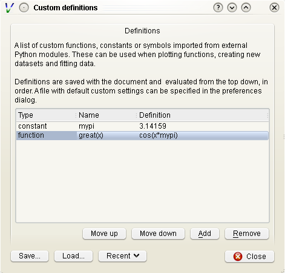

Reading data
============

Currently Veusz supports reading data from files with text, CSV, HDF5,
FITS, 2D text or CSV, QDP, binary and NPY/NPZ formats. Use the
:menuselection:`Data --> Import` dialog to read data, or the importing
commands in the API can be used.  In addition, the user can load or
write import plugins in Python which load data into Veusz in an
arbitrary format. At the moment QDP, binary and NPY/NPZ files are
supported with this method. The HDF5 file format is the most
sophisticated, and is recommended for complex datasets.

By default, data are "linked" to the file imported from. This means
that the data are not stored in the Veusz saved file and are reloaded
from the original data file when opening. In addition, the user can
use the :menuselection:`Data --> Reload` menu option to reload data
from linked files. Unselect the linked option when importing to remove
the association with the data file and to store the data in the Veusz
saved document.

Note that a prefix and suffix can be given when importing. These are
added to the front or back of each dataset name imported. They are
convenient for grouping data together.

.. image:: _images/importdialog.png

We list the various types of import below.

Standard text import
--------------------

The default text import operates on simple text files. The data are
assumed to be in columns separated by whitespace. Each column
corresponds to dataset (or its error bars). Each row is an entry in
the dataset.

The way the data are read is goverened by a simple "descriptor". This
can simply be a list of dataset names separated by spaces. If no
descriptor is given, the columns are treated as separate datasets and
are given names `col1`, `col2`, etc. Veusz attempts to automatically
determine the type of the data.

When reading in data, Veusz treats any whitespace as separating
columns. The columns do not actually need to be aligned. Furthermore a
`\\` symbol can be placed at the end of a line to mark a
continuation. Veusz will read the next line as if it were placed at
the end of the current line. In addition comments and blank lines are
ignored (unless in block mode). Comments start with a `#`, `;`, `!` or
`%`, and continue until the end of the line. The special value `nan`
can be used to specify a break in a dataset.

If the option to read data in blocks is enabled, Veusz treats blank
lines (or lines starting with the word `no`) as block separators. For
each dataset in the descriptor, separate datasets are created for each
block, using a numeric suffix giving the block number, e.g. `_1`, `_2`.

Data types in text import
`````````````````````````

Veusz supports reading in several types of data. The type of data can
be added in round brackets after the name in the descriptor. Veusz
will try to guess the type of data based on the first value, so you
should specify it if there is any form of ambiguity (e.g. is 3 text or
a number). Supported types are numbers (use numeric in brackets) and
text (use text in brackets). An example descriptor would be
`x(numeric) +- y(numeric) + - label(text)` for an x dataset followed
by its symmetric errors, a y dataset followed by two columns of
asymmetric errors, and a final column of text for the label dataset.

A text column does not need quotation unless it contains space
characters or escape characters. However make sure you deselect the
"ignore text" option in the import dialog. This ignores lines of text
to ease the import of data from other applications.  Quotation marks
are recommended around text if you wish to avoid ambiguity. Text is
quoted according to the Python rules for text. Double or single
quotation marks can be used, e.g. `"A 'test'"`, `'A second
"test"'`. Quotes can be escaped by prefixing them with a backslash,
e.g. `"A new \\"test\\""`. If the data are generated from a Python
script, the repr function provides the text in a suitable form.

Dates and times are also supported with the syntax
`dataset(date)`. Dates must be in ISO format `YYYY-MM-DD`. Times are
in 24 hour format hh:mm:ss.ss. Dates with times are written
YYYY-MM-DDThh:mm:ss.ss (this is a standard ISO format, see
`<http://www.w3.org/TR/NOTE-datetime>`_). Dates are stored within
Veusz as a number which is the number of seconds since the start of
January 1st 2009. Veusz also supports dates and times in the local
format, though take note that the same file and data may not work on a
system in a different location.

Descriptors
```````````

.. _Descriptors:

A list of datasets, or a "Descriptor", is given in the
Import dialog to describe how the data are formatted in the
import file. The descriptor at its simplest is a space or
comma-separated list of the names of the datasets to import.
These are columns in the file.

Following a dataset name the text `+`, `-`, or `+-` can be
given to say that the following column is a positive error
bar, negative error bar or symmetric error bar for the
previous (non error bar) dataset. These symbols should be
separated from the dataset name or previous symbol with a
space or a comma symbol.

In addition, if multiple numbered columns should be
imported, the dataset name can be followed by square
brackets containing a range in the form `[a:b]` to number
columns a to b, or `[:]` to number remaining columns. See
below for examples of this use.

Dataset names can contain virtually any character, even
unicode characters. If the name contains non alpha-numeric
characters (characters outside of A-Z, a-z and 0-9), then
the dataset name should be contained within back-tick
characters. An example descriptor is :command:`\`length data
(m)\`,+- \`speed (mps)\`,+,-`, for two datasets with
spaces and brackets in their names.

Instead of specifying the descriptor in the Import dialog,
the descriptor can be placed in the data file using a
descriptor statement on a separate line, consisting of
"descriptor" followed by the descriptor. Multiple
descriptors can be placed in a single file, for example:

::

    # here is one section
    descriptor x,+- y,+,-
    1 0.5  2 0.1 -0.1
    2 0.3  4 0.2 -0.1
    # my next block
    descriptor alpha beta gamma
    1 2 3
    4 5 6
    7 8 9
    # etc...

Descriptor examples
```````````````````

#. :command:`x y` two columns are present in the file, they will be
   read in as datasets `x` and `y`.

#. :command:`x,+- y,+,-` or :command:`x +- y + -` two datasets are in
   the file. Dataset "x" consists of the first two columns. The first
   column are the values and the second are the symmetric errors. "y"
   consists of three columns (note the comma between + and -). The
   first column are the values, the second positive asymmetric errors,
   and the third negative asymmetric errors.  Suppose the input file
   contains:

   ::

       1.0  0.3  2    0.1  -0.2
       1.5  0.2  2.3  2e-2 -0.3E0
       2.19 0.02 5    0.1  -0.1

   Then x will contain `1+-0.3`, `1.5+-0.2`, `2.19+-0.02`. y will
   contain `2 +0.1 -0.2`, `2.3 +0.02 -0.3`, `5 +0.1 -0.1`.

#. :command:`x[1:2] y[:]` the first column is the data `x_1`, the
   second `x_2`. Subsequent columns are read as `y[1]` to `y[n]`.

#. :command:`y[:]+-` read each pair of columns as a dataset and its
   symmetric error, calling them `y[1]` to `y[n]`.

#. :command:`foo,,+-` read the first column as the foo dataset, skip a
   column, and read the third column as its symmetric error.

CSV files
---------

CVS (comma separated variable) files are often written from other
programs, such as spreadsheets, including Excel and Gnumeric. Veusz
supports reading from these files.

In the import dialog choose "CSV", then choose a filename to import
from. In the CSV file the user should place the data in either rows or
columns. Veusz will use a name above a column or to the left of a row
to specify what the dataset name should be. The user can use new names
further down in columns or right in rows to specify a different
dataset name. Names do not have to be used, and Veusz will assign
default `col` and `row` names if not given. You can also specify a
prefix which is prepended to each dataset name read from the file.

To specify symmetric errors for a column, put `+-` as the dataset name
in the next column or row. Asymmetric errors can be stated with `+`
and `-` in the columns.

The data type in CSV files are automatically detected unless
specified. The data type can be given in brackets after the column
name, e.g. `name (text)`, where the data type is `date`, `numeric` or
`text`. Explicit data types are needed if the data look like a
different data type (e.g. a text item of `1.23`). The date format in
CSV files can be specified in the import dialog box - see the examples
given. In addition CSV files support numbers in European format
(e.g. 2,34 rather than 2.34), depending on the setting in the dialog
box.

HDF5 files
----------

HDF5 is a flexible data format. Datasets and tables can be stored in a
hierarchical arrangements of groups within a file. Veusz supports
reading 1D numeric, text, date-time, 2D numeric or n-dimensional
numeric data from HDF files. The :command:`h5py` Python module must be
installed to use HDF5 files (included in binary releases).

In the import dialog box, choose which individual datasets to import,
or selecting a group to import all the datasets within the group. If
selecting a group, datasets in the group incompatible with Veusz are
ignored.

A name can be provided for each dataset imported by entering one under
"Import as". If one is not given, the dataset or column name is
used. The name can also be specified by setting the HDF5 dataset
attribute ``vsz_name`` to the name. Note that for compound datasets
(tables), ``vsz_`` attributes for columns are given by appending the
suffix ``_columnname`` to the attribute.

Error bars
``````````

Error bars are supported in two ways. The first way is to combine 1D
datasets. For the datasets which are error bars, use a name which is
the same as the main dataset but with the suffix `(+-)`, `(+)` or
`(-)`, for symmetric, postive or negative error bars,
respectively. The second method is to use a 2D dataset with two or
three columns, for symmetric or asymmetric error bars,
respectively. Click on the dataset in the dialog and choose the option
to import as a 1D dataset. This second method can also be enabled by
adding an HDF5 attribute ``vsz_twod_as_oned`` set to a non-zero value
for the dataset.

Slices
``````

You may wish to reduce the dimensions of a dataset before importing by
slicing. You can also give a slice to import a subset of a
dataset. When importing, in the slice column you can give a slice
expression. This should have the same number of entries as the dataset
has dimensions, separated by commas. An entry can be a single number,
to select a particular row or column. Alternatively it could be an
expression like ``a:b:c`` or ``a:b``, where ``a`` is the starting
index, ``b`` is one beyond the stopping index and optionally ``c`` is
the step size. A slice can also be specified by providing an HDF5
attribute ``vsz_slice`` for the dataset.

2D data ranges
``````````````

2D data have an associated X and Y range. By default the number of
pixels of the image are used to give this range.  A range can be
specified by clicking on the dataset and entering a minimum and
maximum X and Y coordinates. Alternatively, provide the HDF5 attribute
for the dataset ``vsz_range``, which should be set to an array of four
values (minimum x, minimum y, maximum x, maximum y).

Dates
`````

Date/time datasets can be made from a 1D numeric dataset or from a
text dataset. For the 1D dataset, use the number of seconds relative
to the start of the year 2009 (this is Veusz format) or the year 1970
(this is Unix format). In the import dialog, click on the name of the
dataset and choose the date option. To specify a date format in the
HDF5 file, set the attribute ``vsz_convert_datetime`` to either
``veusz`` or ``unix``.

For text datasets, dates must be given in the right format, selected
in the import dialog after clicking on the dataset name. As in other
file formats, by default Veusz uses ISO 8601 format, which looks like
`2013-12-22T21:08:07`, where the date and time parts are optional. The
T is also optional. You can also provide your own format when
importing by giving a date expression using YYYY, MM, DD, hh, mm and
ss (e.g. `YYYY-MM-DD|T|hh:mm:ss`), where vertical bars mark optional
parts of the expression. To automate this, set the attribute
``vsz_convert_datetime`` to the format expression or ``iso`` to
specify ISO format.

2D text or CSV format
---------------------

Veusz can import 2D data from standard text or CSV files. In this case
the data should consist of a matrix of data values, with the columns
separated by one or more spaces or tabs and the rows on different
lines.

In addition to the data the file can contain lines at the top which
affect the import. Such specifiers are used, for example, to change
the coordinates of the pixels in the file. By default the first pixels
coordinates is between 0 and 1, with the centre at 0.5. Subsequent
pixels are 1 greater. Note that the lowest coordinate pixel is the
bottom-left value in the table of imported values. When using
specifiers in CSV files, put the different parts (separated by spaces)
in separate columns. Below are listed the specifiers:

#. :command:`xrange A B` - make the 2D dataset span the coordinate
   range A to B in the x-axis (where A and B are numbers). Note that
   the range is inclusive, so a 1 pixel wide image with A=0 and B=1
   would have the pixel centre at 0.5. The pixels are assumed to have
   the same spacing. Do not use this as the same time as the
   :command:`xedge` or :command:`xcent` options.

#. :command:`yrange A B` - make the 2D dataset span the coordinate
   range A to B in the y-axis (where A and B are numbers).

#. :command:`xedge A B C...` - rather than assume the pixels have the
   same spacing, give the coordinates of the edges of the pixels in
   the x-axis. The numbers should be space-separated and there should
   be one more number than pixels. Do not give :command:`xrange` or
   :command:`xcent` if this is given. If the values are increasing,
   the lowest coordinate value is at the left of the dataset,
   otherwise if they are decreasing, it is on the right (unless the
   rows/columns are inverted or transposed).

#. :command:`yedge A B C...` - rather than assume the pixels have the
   same spacing, give the coordinates of the edges of the pixels in
   the y-axis. If the values are increasing, the lowest coordinate
   value is at the bottom row. If they instead decrease, it is at the
   top.

#. :command:`xcent A B C...` - rather than give a total range or pixel
   edges, give the centres of the pixels. There should be the same
   number of values as pixels in the image. Do not give
   :command:`xrange` or :command:`xedge` if this is given. The order
   of the values specify whether the pixels are left to right or right
   to left.

#. :command:`ycent A B C...` - rather than give a total range or pixel
   edges, give the centres of the pixels. The value order specifies
   whether the pixels are bottom to top, or top to bottom.

#. :command:`invertrows` - invert the rows after reading the data.

#. :command:`invertcols` - invert the columns after reading the data.

#. :command:`transpose` - swap rows and columns after importing data.

#. :command:`gridatedge` - the first row and leftmost column give the
   positions of the centres of the pixels. This is also an option in
   the import dialog. The values should be increasing or decreasing.

FITS files
----------

1D, 2D or n-dimensional data can be read from FITS files. 1D or 2D
data can be read from image, primary or table HDUs. nD data can be
read from from image or primary extensions.  Note that pyfits or
astropy must be installed to get FITS support.

The import dialog box uses a tree to show the structure of the FITS
file. The user can choose to import the whole file, by clicking the
check box at the top. They can import data from a particular HDU by
selecting that, or individual table columns can be selected.

In the dialog box, a dataset can be given a name for the
dataset. Otherwise the HDU or table column name is used.  Note that a
prefix and/or suffix can be specified to be added to all dataset
names.

If dataset y should have an error bar specified by column yerr, then
in the name for yerr, enter 'y (+-)'. Asymmetric error bars can be
specified using (+) and (-) on inidividual columns.

The slice column can be used to only import a subset of the dataset
imported. This uses Python slicing syntax, which is comma-separated
list of ranges and steps. A range is specified like 10:20, which
selects the 11th to 20th items (the indices are numbered from 0, and
the final index is one past the index you actually want). A stepped
range can look like 10:20:2, which selects every other item in that
range. Each of these numbers are optional, so : selects all items on
that dimension. For example the slice :,10:14:2 selects all values on
the first dimension, but only the 11th and 13th items on the next
axis.

When importing 2D data the user can specify whether to treat this as
1D plus error bars (dimensions should have 2 or 3 columns), or specify
a range in 2D space the data covers.  Veusz will also attempt to use
WCS information in the file for the 2D range if not specified. The
standard mode is to use the CDELT, CRVAL and CRPIX keywords to specify
a linear range for the data. Alternatively the user can specify pixel
numbering (numbering from 0 to N-1). There is a fraction option for
using a range of 0 to 1. Finally there is a pixel numbering scheme
which numbers in pixels from the CRPIX keyword items.

Some of these options can be specified in the FITS file using the
'VEUSZ' header keyword. This header keyword can be added with the
value 'KEY=VALUE' (applying to the whole HDU) or 'COLUMN: KEY=VALUE'
(applying to a particular column in a table). Supported options for
KEY are:

name
  provide name for dataset in VALUE

slice
  VALUE is slice to apply when importing dataset

range
  range of data for 2D dataset in form `[minx, miny, maxx, maxy]`

xrange/yrange
  range of dataset individually in x or y

xcent/ycent
  set to list of values giving centers of pixels

xedge/yedge
  set to list of values giving edges of pixels

twod_as_oned
  treat as 1D data with error bars if VALUE=1

wcsmode
  use specific WCS mode for 2D dataset (should be
  pixel/pixel_wcs/linear_wcs/fraction)

Reading other data formats
--------------------------

As mentioned above, a user may write some Python code to read a data
file or set of data files. To write a plugin which is incorportated
into Veusz, see `<https://github.com/veusz/veusz/wiki/ImportPlugins>`_

You can also include Python code in an input file to read data, which
we describe here. Suppose an input file "in.dat" contains the
following data:

::

    1   2
    2   4
    3   9
    4   16

Of course this data could be read using the :ref:`ImportFile
<Command.ImportFile>` command. However, you could also read it with
the following Veusz script (which could be saved to a file and loaded
with :command:`execfile` or :ref:`Load <Command.Load>`. The script
also places symmetric errors of 0.1 on the x dataset.

.. code-block:: python

    x = []
    y = []
    for line in open("in.dat"):
        parts = [float(i) for i in line.split()]
        x.append(parts[0])
        y.append(parts[1])
    SetData('x', x, symerr=0.1)
    SetData('y', y)

Manipulating datasets
=====================

Imported datasets can easily be modified in the Data Editor dialog
box. This dialog box can also be used to create new datasets from
scratch by typing them in. The Data Create dialog box is used to new
datasets as a numerical sequence, parametrically or based on other
datasets given expressions. If you want to plot a function of a
dataset, you often do not have to create a new dataset. Veusz allows
to enter expressions directly in many places.

Using dataset plugins
---------------------

Dataset plugins can be used to perform arbitrary manipulation of
datasets. Veusz includes several plugins for mathematical operation of
data and other dataset manipulations, such as concatenation or
splitting. If you wish to write your own plugins look at
`<https://github.com/veusz/veusz/wiki/DatasetPlugins>`_.

Using expressions to create new datasets
----------------------------------------

For instance, if the user has already imported dataset d, then they
can create d2 which consists of d**2. Expressions are in Python numpy
syntax and can include the usual mathematical functions.

.. image:: _images/createdataset.png

Expressions for error bars can also be given. By appending
:command:`_data`, :command:`_serr`, :command:`_perr` or
:command:`_nerr` to the name of the dataset in the expression, the
user can base their expression on particular parts of the given
dataset (the main data, symmetric errors, positive errors or negative
errors). Otherwise the program uses the same parts as is currently
being specified.

If a dataset name contains non alphanumeric characters, its name
should be quoted in the expression in back-tick characters,
e.g. :command:`\`length (cm)\`*2`.

The numpy functionality is particularly useful for doing more
complicated expressions. For instance, a conditional expression can be
written as :command:`where(x<y,x,y)` or
:command:`where(isfinite(x),a,b))`.

You often do not need to create a new dataset when. For example, with
the xy point plotter widget, you can directly enter an expression as
the X and Y dataset settings. When you give a direct dataset
expression, you can define error bar expressions by separating them by
commas, and optionally surrounding them by brackets. For example
:command:`(a,0.1)` plots dataset a as the data, with symmetric errors
bars of 0.1. Asymmetric bars are given as :command:`(a,a*0.1,-a*0.1)`.

Other useful functions in evaluation include those already mentioned
in the LaTeX expansion description. :command:`DATA(name, \[part])`
returns the dataset with name given. The optional part, which can be
'data', 'serr', 'perr' or 'nerr', allows error bars to be returned for
numerical data. :command:`SETTING(path)` returns the value of the
Veusz setting, which can include, for example, the best fitting
parameters of a fit. :command:`ENVIRON` is the Python environment
variable dictionary, allowing values to be passed from the
environment, e.g. :command:`float(ENVIRON['myvar'])`.

Linking datasets to expressions
-------------------------------

A particularly useful feature is to be able to link a dataset to an
expression, so if the expression changes the dataset changes with it,
like in a spreadsheet.

Splitting data
--------------

Data can also be chopped in this method, for example using the
expression :command:`x[10:20]`, which makes a dataset based on the
11th to 20th item in the x dataset (the ranges are Python syntax, and
are zero-based). Negative indices count backwards from the end of the
dataset. Data can be skipped using expressions such as
:command:`data[::2]`, which skips every other element

Defining new constants or functions
-----------------------------------

User defined constants or functions can be defined in the "Custom
definitions" dialog box under the edit menu. Functions can also be
imported from external python modules.



Custom definitions are defined on a per-document basis, but can be
saved or loaded into a file. A default custom definitions file can be
set in the preferences dialog box.

Dataset plugins
---------------

In addition to creating datasets based on expressions, a variety of
dataset plugins exist, which make certain operations on datasets much
more convenient. See the Data, Operations menu for a list of the
default plugins. The user can easily create new plugins. See
`<https://github.com/veusz/veusz/wiki/DatasetPlugins>`_ for details.

Capturing data
==============

In addition to the standard data import, data can be captured as it is
created from an external program, a network socket or a file or named
pipe. When capturing from a file, the behaviour is like the Unix
:command:`tail -f` command, where new lines written to the file are
captured. To use the capturing facility, the data must be written in
the simple line based standard Veusz text format. Data are whitespace
separated, with one value per dataset given on a single line.

To capture data, use the dialog box :menuselection:`Data -->
Capture`. A list of datasets should be given. This is the
:ref:`standard descriptor format <Descriptors>`.  Choose the source of
the data, which is either a a filename or named pipe, a network socket
to connect to, or a command line for an external program. Capturing
ends if the source of the data runs out (for external programs or
network sockets) or the finish button is clicked. It can optionally
end after a certain number of data lines or when a time period has
expired. Normally the data are updated in Veusz when the capturing is
finished. There is an option to update the document at intervals,
which is useful for monitoring.  A plot using the variables will
update when the data are updated.

Click the ``Capture`` button to start the capture. Click ``Finish`` or
``Cancel`` to stop. Cancelling destroys captured data.
