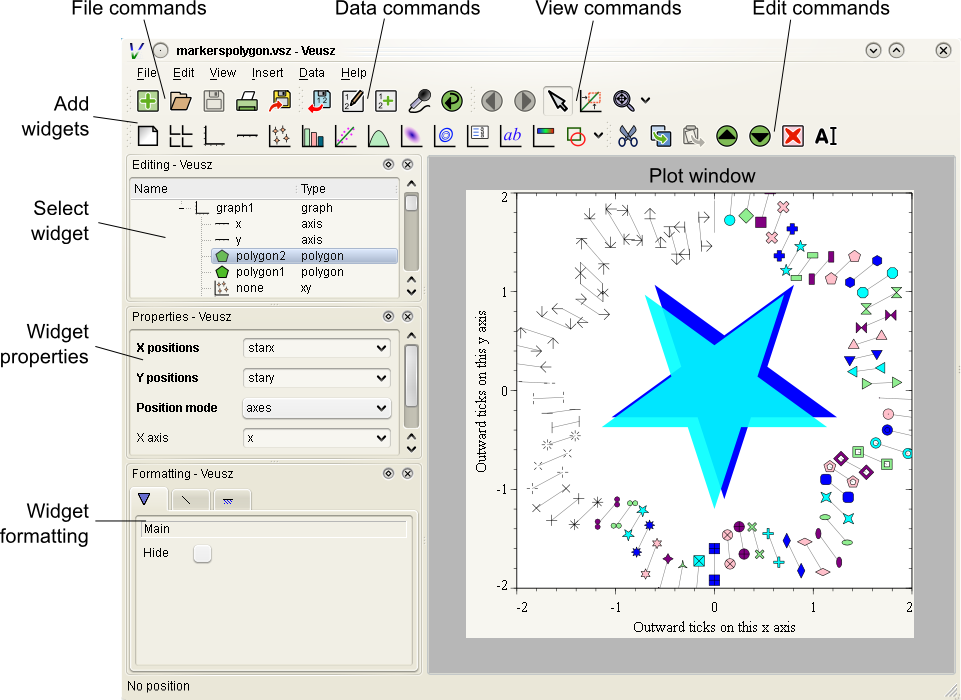
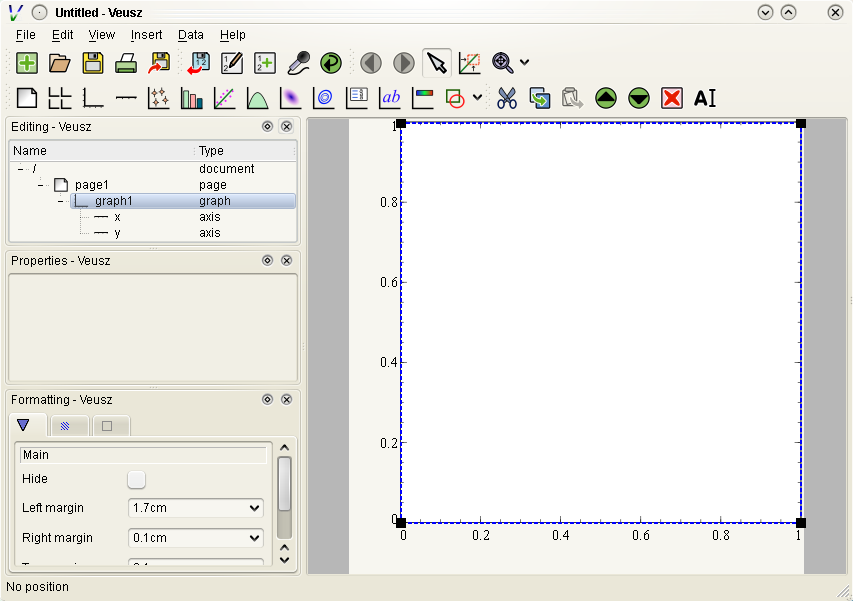
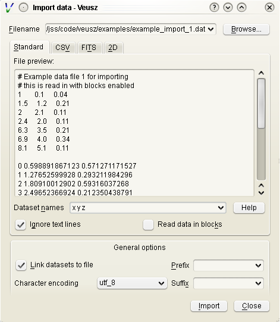

=====================================
Veusz - a scientific plotting package
=====================================

Jeremy Sanders

Copyright 2017

This document is licensed under the GNU General Public
License, version 2 or greater. Please see the file COPYING for
details, or see `<http://www.gnu.org/licenses/gpl-2.0.html>`_.

Introduction
############

Veusz
=====

Veusz is a scientific plotting package. It was designed to be easy to
use, easily extensible, but powerful. The program features a graphical
user interface, which works under Unix/Linux, Windows or Mac OS X. It
can also be easily scripted (the saved file formats are similar to
Python scripts) or used as module inside Python. Veusz reads data from
a number of different types of data file, it can be manually entered,
or constructed from other datasets.

In Veusz the document is built in an object-oriented fashion, where a
document is built up by a number of widgets in a hierarchy. For
example, multiple function or xy widgets can be placed inside a graph
widget, and many graphs can be placed in a grid widget.

The technologies behind Veusz include PyQt (a very easy to use Python
interface to Qt, which is used for rendering and the graphical user
interface, GUI) and numpy (a package for Python which makes the
handling of large datasets easy). Veusz can be extended by the user
easily by adding plugins. Support for different data file types can be
added with import plugins. Dataset plugins automate the manipulation
of datasets. Tools plugins automate the manipulation of the document.

Terminology
===========

Here we define some terminology for future use.

Widget
------

A document and its graphs are built up from widgets.  These widgets
can often by placed within each other, depending on the type of the
widget. A widget has children (those widgets placed within it) and its
parent. The widgets have a number of different settings which modify
their behaviour. These settings are divided into properties, which
affect what is plotted and how it is plotted. These would include the
dataset being plotted or whether an axis is logarithmic.  There are
also formatting settings, including the font to be used and the line
thickness. In addition they have actions, which perform some sort of
activity on the widget or its children, like "fit" for a fit widget.

As an aside, using the scripting interface, widgets are
specified with a "path", like a file in Unix or Windows. These
can be relative to the current widget (do not start with a
slash), or absolute (start with a slash). Examples of
paths include, `/page1/graph1/x`, `x` and `.`.

The widget types include

#. :command:`document` - representing a complete document. A document
   can contain pages. In addition it contains a setting giving the
   page size for the document.

#. :command:`page` - representing a page in a document. One or more
   graphs can be placed on a page, or a grid.

#. :command:`graph` - defining an actual graph. A graph can be placed
   on a page or within a grid. Contained within the graph are its axes
   and plotters. A graph can be given a background fill and a border
   if required. It also has a margin, which specifies how far away
   from the edge of its parent widget to plot the body of the graph.
   A graph can contain several axes, at any position on the plot. In
   addition a graph can use axes defined in parent widgets, shared
   with other graphs.  More than one graph can be placed within in a
   page. The margins can be adjusted so that they lie within or
   besides each other.

#. :command:`grid` - containing one or more graphs. A grid plots
   graphs in a gridlike fashion. You can specify the number of rows
   and columns, and the plots are automatically replotted in the
   chosen arrangement. A grid can contain graphs or axes. If an axis
   is placed in a grid, it can be shared by the graphs in the grid.

#. :command:`axis` - giving the scale for plotting data. An axis
   translates the coordinates of the data to the screen. An axis can
   be linear or logarithmic, it can have fixed endpoints, or can
   automatically get them from the plotted data. It also has settings
   for the axis labels and lines, tick labels, and major and minor
   tick marks.  An axis may be "horizontal" or "vertical" and can
   appear anywhere on its parent graph or grid.  If an axis appears
   within a grid, then it can be shared by all the graphs which are
   contained within the grid.  The :command:`axis-broken` widget is an
   axis sub-type. It is an axis type where there are jumps in the
   scale of the axis.  The :command:`axis-function` widget allows the
   user to create an axis where the values are scaled by a monotonic
   function, allowing non-linear and non-logarithmic axis scales. The
   widget can also be linked to a different axis via the function.

#. plotters - types of widgets which plot data or add other things on
   a graph. There is no actual plotter widget which can be added, but
   several types of plotters listed below. Plotters typically take an
   axis as a setting, which is the axis used to plot the data on the
   graph (default x and y).

   #. :command:`function` - a plotter which plots a function on the
      graph. Functions can be functions of x or y (parametric
      functions are not done yet!), and are defined in Python
      expression syntax, which is very close to most other
      languages. For example `3*x**2 + 2*x - 4`. A number of functions
      are available (e.g. sin, cos, tan, exp, log...). Technically,
      Veusz imports the numpy package when evaluating, so numpy
      functions are available.  As well as the function setting, also
      settable is the line type to plot the function, and the number
      of steps to evaluate the function when plotting. Filling is
      supported above/below/left/right of the function.
   #. :command:`xy` - a plotter which plots scatter, line, or stepped
      plots. This versatile plotter takes an x and y dataset, and
      plots (optional) points, in a chosen marker and colour,
      connecting them with (optional) lines, and plotting (optional)
      error bars. An xy plotter can also plot a stepped line, allowing
      histograms to be plotted (note that it doesn't yet do the
      binning of the data).  The settings for the xy widget are the
      various attibutes for the points, line and error bars, the
      datasets to plot, and the axes to plot on.  The xy plotter can
      plot a label next to each dataset, which is either the same for
      each point or taken from a text dataset.  If you wish to leave
      gaps in a plot, the input value `nan` can be specified in the
      numeric dataset.
   #. :command:`fit` - fit a function to data. This plotter is a like
      the function plotter, but allows fitting of the function to
      data. This is achived by clicking on a "fit" button, or using
      the "fit" action of the widget. The fitter takes a function to
      fit containing the unknowns, e.g. `a*x**2 + b*x + c`, and
      initial values for the variables (here a, b and c). It then fits
      the data (note that at the moment, the fit plotter fits all the
      data, not just the data that can be seen on the graph) by
      minimising the chi-squared.  In order to fit properly, the y
      data (or x, if fitting as a function of x) must have a properly
      defined, preferably symmetric error. If there is none, Veusz
      assumes the same fractional error everywhere, or symmetrises
      asymmetric errors.  Note that more work is required in this
      widget, as if a parameter is not well defined by the data, the
      matrix inversion in the fit will fail. In addition Veusz does
      not supply estimates for the errors or the final chi-squared in
      a machine readable way.  If the fitting parameters vary
      significantly from 1, then it is worth "normalizing" them by
      adding in a factor in the fit equation to bring them to of the
      order of 1.
   #. :command:`bar` - a bar chart which plots sets of data as
      horizontal or vertical bars. Multiple datasets are supported. In
      "grouped" mode the bars are placed side-by-side for each
      dataset. In "stacked" mode the bars are placed on top of each
      other (in the appropriate direction according to the sign of the
      dataset). Bars are placed on coordinates given, or in integer
      values from 1 upward if none are given. Error bars are plotted
      for each of the datasets.  Different fill styles can be given
      for each dataset given. A separate key value can be given for
      each dataset.
   #. :command:`key` - a box which describes the data plotted. If a
      key is added to a plot, the key looks for "key" settings of the
      other data plotted within a graph. If there any it builds up a
      box containing the symbol and line for the plotter, and the text
      in the "key" setting of the widget. This allows a key to be very
      easily added to a plot.  The key may be placed in any of the
      corners of the plot, in the centre, or manually
      placed. Depending on the ordering of the widgets, the key will
      be placed behind or on top of the widget. The key can be filled
      and surrounded by a box, or not filled or surrounded.
   #. :command:`label` - a text label places on a graph. The alignment
      can be adjusted and the font changed. The position of the label
      can be specified in fractional terms of the current graph, or
      using axis coordinates.
   #. :command:`rect, ellipse` - these draw a rectangle or ellipse,
      respectively, of size and rotation given. These widgets can be
      placed directly on the page or on a graph. The centre can be
      given in axis coordinates or fractional coordinates.
   #. :command:`imagefile` - draw an external graphs file on the graph
      or page, with size and rotation given. The centre can be given
      in axis coordinates or fractional coordinates.
   #. :command:`line` - draw a line with optional arrowheads on the
      graph or page. One end can be given in axis coordinates or
      fractional coordinates.
   #. :command:`contour` - plot contours of a 2D dataset on the
      graph. Contours are automatically calculated between the minimum
      and maximum values of the graph or chosen manually. The line
      style of the contours can be chosen individually and the region
      between contours can be filled with shading or color.  2D
      datasets currently consist of a regular grid of values between
      minimum and maximum positions in x and y. They can be
      constructed from three 1D datasets of x, y and z if they form a
      regular x, y grid.
   #. :command:`image` - plot a 2D dataset as a colored
      image. Different color schemes can be chosen. The scaling
      between the values and the image can be specified as linear,
      logarithmic, square-root or square.
   #. :command:`polygon` - plot x and y points from datasets as a
      polygon. The polygon can be placed directly on the page or
      within a graph. Coordinates are either plotted using the axis or
      as fractions of the width and height of the containing widget.
   #. :command:`boxplot` - plot distribution of points in a dataset.
   #. :command:`polar` - plot polar data or functions. This is a
      non-orthogonal plot and is placed directly on the page rather
      than in a graph.
   #. :command:`ternary` - plot data of three variables which add up
      to 100 per cent.This is a non-orthogonal plot and is placed
      directly on the page rather than in a graph.

Settings: properties and formatting
-----------------------------------

The various settings of the widgets come in a number of types,
including integers (e.g. 10), floats (e.g. 3.14), dataset names
(`mydata`), expressions (`x+y`), text (`hi there!`), distances (see
above), options (`horizontal` or `vertical` for axes).

Veusz performs type checks on these parameters. If they
are in the wrong format the control to edit the setting will
turn red. In the command line, a TypeError exception is
thrown.

In the GUI, the current page is replotted if a setting
is changed when enter is pressed or the user moves to another
setting.

The settings are split up into formatting settings,
controlling the appearance of the plot, or properties,
controlling what is plotted and how it is plotted.

Default settings, including the default font and line
style, and the default settings for any graph widget, can be
modified in the "Default styles" dialog box under the "Edit"
menu. Default settings are set on a per-document basis, but
can be saved into a separate file and loaded. A default
default settings file can be given to use for new documents
(set in the preferences dialog).

Datasets
--------

Data are imported into Veusz as a dataset. A dataset is
imported from a file, entered manually, set via the command
line, or linked to other datasets via an expression or
dataset plugin. Each dataset has a unique name in the
document. They can be seen in the dataset browser panel, or
in the Data, Edit dialog box.  To choose the data to be
plotted, the user usually selects the dataset in the
appropriate setting of a widget.

Veusz supports one-dimensional (1D) datasets, which are a
list of values with optional error bars. Error bars can
either be symmetric or asymmetric. Veusz also supports
two-dimensional (2D) data. A 2D dataset is a grid of values,
with either a fixed spacing in coordinates, or with
arbitrary pixel sizes. An n-dimensional (nD) dataset is an
arbitrary matrix of values. These cannot be plotted
directly, but subsets can be plotted using python slice
syntax to convert to 1D or 2D datasets.

In addition to simple numeric datasets, Veusz also supports
date-time datasets. For details see the sections on reading
data. Also supported are text datasets, which are lists of
text strings.

Datasets can either be plain lists of values which are
stored within the document, or they can be linked to a file,
so that the values update if the file is reloaded, or they
can be linked to other datasets via expressions or dataset
plugins.

.. _TextFonts:

Text
--------------------

Veusz understands a limited set of LaTeX-like formatting
for text. There are some differences (for example, `10^23`
puts the 2 and 3 into superscript), but it is fairly
similar. You should also leave out the dollar signs. Veusz
supports superscripts (`^`), subscripts (`_`), brackets for
grouping attributes are `{` and `}`.

Supported LaTeX symbols include: \\AA, \\Alpha, \\Beta,
\\Chi, \\Delta, \\Epsilon, \\Eta, \\Gamma, \\Iota, \\Kappa, \\Lambda, \\Mu,
\\Nu, \\Omega, \\Omicron, \\Phi, \\Pi, \\Psi, \\Rho, \\Sigma, \\Tau, \\Theta,
\\Upsilon, \\Xi, \\Zeta, \\alpha, \\approx, \\ast, \\asymp, \\beta, \\bowtie,
\\bullet, \\cap, \\chi, \\circ, \\cup, \\dagger, \\dashv, \\ddagger, \\deg,
\\delta, \\diamond, \\divide, \\doteq, \\downarrow, \\epsilon, \\equiv,
\\eta, \\gamma, \\ge, \\gg, \\in, \\infty, \\int, \\iota, \\kappa, \\lambda,
\\le, \\leftarrow, \\lhd, \\ll, \\models, \\mp, \\mu, \\neq, \\ni, \\nu, \\odot,
\\omega, \\omicron, \\ominus, \\oplus, \\oslash, \\otimes, \\parallel,
\\perp, \\phi, \\pi, \\pm, \\prec, \\preceq, \\propto, \\psi, \\rhd, \\rho,
\\rightarrow, \\sigma, \\sim, \\simeq, \\sqrt, \\sqsubset, \\sqsubseteq,
\\sqsupset, \\sqsupseteq, \\star, \\stigma, \\subset, \\subseteq, \\succ,
\\succeq, \\supset, \\supseteq, \\tau, \\theta, \\times, \\umid, \\unlhd,
\\unrhd, \\uparrow, \\uplus, \\upsilon, \\vdash, \\vee, \\wedge, \\xi, \\zeta.
Please request additional characters if they are required (and exist
in the unicode character set). Special symbols can be included
directly from a character map.

Other LaTeX commands are supported. `\\\\` breaks a
line. This can be used for simple tables. For example `{a\\\\b}
{c\\\\d}` shows `a c` over `b d`. The command `\\frac{a}{b}`
shows a vertical fraction a/b.

Also supported are commands to change font. The command
`\\font{name}{text}` changes the font text is written in to
name. This may be useful if a symbol is missing from the
current font, e.g. `\\font{symbol}{g}` should produce a
gamma. You can increase, decrease, or set the size of the font
with `\\size{+2}{text}`, `\\size{-2}{text}`, or
`\\size{20}{text}`. Numbers are in points.

Various font attributes can be changed: for example,
`\\italic{some italic text}` (or use `\\textit` or `\\emph`),
`\\bold{some bold text}` (or use `\\textbf`) and `\\underline{some
underlined text}`.

Example text could include `Area / \\pi (10^{-23}
cm^{-2})`, or `\\pi\\bold{g}`.

Veusz plots these symbols with Qt's unicode support. You
can also include special characters directly, by copying and
pasting from a character map application. If your current font
does not contain these symbols then you may get a box
character.

Veusz also supports the evaluation of a Python
expression when text is written to the page. Python code is
written inside the brackets :command:`%{{ }}%`. Note
that the Python evaluation happens before the LaTeX expansion
is done. The return value of the expression is converted to
text using the Python :command:`str()` function. For
example, the expression :command:`%{{2+2}}%` would
write :command:`4`. Custom functions and constants are
supported when evaluation, in addition to the usual numpy
functions. In addition, Veusz defines the following useful
functions and values.

#. :command:`ENVIRON` is the
   :command:`os.environ` dict of environment
   variables. :command:`%{{ENVIRON['USER']}}%`
   would show the current user in unix.

#. :command:`DATE([fmt])` returns the current
   date, by default in ISO format. fmt is an optional
   format specifier using
   :command:`datetime.date.strftime` format
   specifiers.

#. :command:`TIME([fmt])` returns the current
   date/time, by default in ISO format. fmt is an optional
   format specifier using
   :command:`datetime.datetime.strftime` format
   specifiers.

#. :command:`DATA(name[, part])` returns the Veusz
   dataset with given name. For numeric datasets this is a
   numpy array. For numeric datasets with errors, part
   specifies the dataset part to return, i.e. 'data',
   'serr', 'perr', 'nerr'. For example, the mean value of
   a dataset could be shown using
   :command:`%{{mean(DATA('x'))}}%`.

#. :command:`FILENAME()` - returns the current
   document filename. This can include the
   directory/folder of the file. Note that the filename is
   escaped with ESCAPE() so that LaTeX symbols are not
   expanded when shown.

#. :command:`BASENAME()` - returns the current
   document filename, removing the directory or folder
   name Note that the filename is escaped with ESCAPE() so
   that LaTeX symbols are not expanded when shown.

#. :command:`ESCAPE(x)` - escapes any LaTeX
   symbols in x so that they are not interpreted as
   LaTeX.

#. :command:`SETTING(path)` - return the value of
   the Veusz setting given by the full path,
   e.g. :command:`%{{SETTING('/page1/width')}}%`.

Measurements
------------

Distances, widths and lengths in Veusz can be specified
in a number of different ways. These include absolute
distances specified in physical units, e.g. 1cm, 0.05m, 10mm,
5in and 10pt, and relative units, which are relative to
the largest dimension of the page, including 5%, 1/20,
0.05.

Color theme
-----------

From version 1.26, widgets are colored automatically
using the color theme. This theme is specified in the main
document widget settings. Widgets are given the colors in
order given the order in a graph widget. The default theme can
be specified in the preferences dialog box.

To override a theme, the user can manually specify the
individual colors in the custom definitions dialog box. Color
`theme1` is used as the first theme color, then `theme2`,
etc.

Axis numeric scales
-------------------

The way in which numbers are formatted in axis scales is
chosen automatically. For standard numerical axes, values are
shown with the `%Vg` formatting (see below). For date axes, an
appropriate date formatting is used so that the interval shown
is correct. A format can be given for an axis in the axis
number formatting panel can be given to explicitly choose a
format. Some examples are given in the drop down axis
menu. Hold the mouse over the example for detail.

C-style number formatting is used with a few Veusz
specific extensions. Text can be mixed with format specifiers,
which start with a `%` sign. Examples of C-style formatting
include: `%.2f` (decimal number with two decimal places,
e.g. 2.01), `%.3e` (scientific formatting with three decimal
places, e.g. 2.123e-02), `%g` (general formatting, switching
between `%f` and `%e` as appropriate). See `<http://opengroup.org/onlinepubs/007908799/xsh/fprintf.html>`_ for details.

Veusz extensions include `%Ve`, which is like `%e`
except it displays scientific notation as written,
e.g. 1.2x10^23, rather than 1.2e+23. `%Vg` switches between
standard numbers and Veusz scientific notation for large and
small numbers. `%VE` using engineering SI suffixes to
represent large or small numbers (e.g. 1000 is 1k).

Veusz allows dates and times to be formatted using
`%VDX` where `X` is one of the formatting characters for
strftime (see
`<http://opengroup.org/onlinepubs/007908799/xsh/strftime.html>`_ for details). These include `a` for an abbreviated weekday
name, `A` for full weekday name, `b` for abbreviated month
name, `B` for full month name, `c` date and time
representaiton, `d` day of month 01..31, `H` hour as 00..23,
`I` hour as 01..12, `j` as day of year 001..366, `m` as month
01..12, `M` minute as 00..59, `p` AM/PM, `S` second 00..61,
`U` week number of year 00..53 (Sunday as first day of week),
`w` weekday as decimal number 0..6, `W` week number of year
(Monday as first day of week), `x` date representation, `X`
time representation, `y` year without century 00..99 and `Y`
year. `%VDVS` is a special Veusz addon format which shows
seconds and fractions of seconds (e.g. 12.2).

Installation
============

Please look at the Installation notes (INSTALL) for details on
installing Veusz.

The main window
===============

You should see the main window when you run Veusz (you can just type
the veusz command in Unix).

The Veusz window is split into several sections. At the top is the
menu bar and tool bar. These work in the usual way to other
applications. Sometimes options are disabled (greyed out) if they do
not make sense to be used. If you hold your mouse over a button for a
few seconds, you will usually get an explanation for what it does
called a "tool tip".

Below the main toolbar is a second toolbar for constructing the graph
by adding widgets (on the left), and some editing buttons. The add
widget buttons add the request widget to the currently selected widget
in the selection window. The widgets are arranged in a tree-like
structure.

Below these toolbars and to the right is the plot window. This is
where the current page of the current document is shown. You can
adjust the size of the plot on the screen (the zoom factor) using the
"View" menu or the zoom tool bar button (the magnifying
glass). Initially you will not see a plot in the plot window, but you
will see the Veusz logo. At the moment you cannot do much else with
the window. In the future you will be able to click on items in the
plot to modify them.

To the left of the plot window is the selection window, and the
properties and formatting windows. The properties window lets you edit
various aspects of the selected widget (such as the minimum and
maximum values on an axis). Changing these values should update the
plot. The formatting lets you modify the appearance of the selected
widget. There are a series of tabs for choosing what aspect to modify.

The various windows can be "dragged" from the main window to "float"
by themselves on the screen.

To the bottom of the window is the console. This window is not shown
by default, but can be enabled in the View menu. The console is a
Veusz and Python command line console. To read about the commands
available see :ref:`Commands <Commands>`. As this is a Python console,
you can enter mathematical expressions (e.g. `1+2.0*cos(pi/4)`) here
and they will be evaluated when you press Enter. The usual special
functions and the operators are supported. You can also assign results
to variables (e.g. `a=1+2`) for use later. The console also supports
command history like many Unix shells. Press the up and down cursor
keys to browse through the history. Command line completion is not
available yet!

There also exists a dataset browsing window, by default to the right
of the screen. This window allows you to view the datasets currently
loaded, their dimensions and type. Hovering a mouse over the size of
the dataset will give you a preview of the data.

My first plot
=============

After opening Veusz, on the left of the main window, you will see a
Document, containing a Page, which contains a Graph with its axes. The
Graph is selected in the selection window. The toolbar above adds a
new widget to the selected widget. If a widget cannot be added to a
selected widget it is disabled. On opening a new document Veusz
automatically adds a new Page and Graph (with axes) to the document.

You will see something like this:

Select the x axis which has been added to the document (click on `x`
in the selection window). In the properties window you will see a
variety of different properties you can modify. For instance you can
enter a label for the axis by writing `Area (cm^{2})` in the box next
to label and pressing enter. Veusz supports text in LaTeX-like form
(without the dollar signs). Other important parameters is the `log`
switch which switches between linear and logarithmic axes, and `min`
and `max` which allow the user to specify the minimum and maximum
values on the axes.

The formatting dialog lets you edit various aspects of the graph
appearance. For instance the "Line" tab allows you to edit the line of
the axis. Click on "Line", then you can then modify its colour. Enter
"green" instead of "black" and press enter. Try making the axis label
bold.

Now you can try plotting a function on the graph. If the graph, or its
children are selected, you will then be able to click the "function"
button at the top (a red curve on a graph). You will see a straight
line (y=x) added to the plot. If you select "function1", you will be
able to edit the functional form plotted and the style of its
line. Change the function to `x**2` (x-squared).

We will now try plotting data on the graph. Go to your
favourite text editor and save the following data as
test.dat:

::

    1     0.1   -0.12   1.1    0.1
    2.05  0.12  -0.14   4.08   0.12
    2.98  0.08  -0.1    2.9    0.11
    4.02  0.04  -0.1    15.3   1.0

The first three columns are the x data to plot plus its asymmetric
errors. The final two columns are the y data plus its symmetric
errors. In Veusz, go to the "Data" menu and select "Import". Type the
filename into the filename box, or use the "Browse..." button to
search for the file. You will see a preview of the data pop up in the
box below. Enter `x,+,- y,+-` into the descriptors edit box (note that
commas and spaces in the descriptor are almost interchangeable in
Veusz 1.6 or newer). This describes the format of the data which
describes dataset "x" plus its asymmetric errors, and "y" with its
symmetric errors. If you now click "Import", you will see it has
imported datasets `x` and `y`.

To plot the data you should now click on `graph1` in the tree
window. You are now able to click on the "xy" button (which looks like
points plotted on a graph). You will see your data plotted on the
graph. Veusz plots datasets `x` and `y` by default, but you can change
these in the properties of the "xy" plotter.

You are able to choose from a variety of markers to plot. You can
remove the plot line by choosing the "Plot Line" subsetting, and
clicking on the "hide" option. You can change the colour of the marker
by going to the "Marker Fill" subsetting, and entering a new colour
(e.g. red), into the colour property.

Reading data
############

Currently Veusz supports reading data from files with text, CSV, HDF5,
FITS, 2D text or CSV, QDP, binary and NPY/NPZ formats. Use the
:menuselection:`Data --> Import` dialog to read data, or the importing
commands in the API can be used.  In addition, the user can load or
write import plugins in Python which load data into Veusz in an
arbitrary format. At the moment QDP, binary and NPY/NPZ files are
supported with this method. The HDF5 file format is the most
sophisticated, and is recommended for complex datasets.

By default, data are "linked" to the file imported from. This means
that the data are not stored in the Veusz saved file and are reloaded
from the original data file when opening. In addition, the user can
use the :menuselection:`Data --> Reload` menu option to reload data
from linked files. Unselect the linked option when importing to remove
the association with the data file and to store the data in the Veusz
saved document.

Note that a prefix and suffix can be given when importing. These are
added to the front or back of each dataset name imported. They are
convenient for grouping data together.

We list the various types of import below.

Standard text import
====================

The default text import operates on simple text files. The data are
assumed to be in columns separated by whitespace. Each column
corresponds to dataset (or its error bars). Each row is an entry in
the dataset.

The way the data are read is goverened by a simple "descriptor". This
can simply be a list of dataset names separated by spaces. If no
descriptor is given, the columns are treated as separate datasets and
are given names `col1`, `col2`, etc. Veusz attempts to automatically
determine the type of the data.

When reading in data, Veusz treats any whitespace as separating
columns. The columns do not actually need to be aligned. Furthermore a
`\\` symbol can be placed at the end of a line to mark a
continuation. Veusz will read the next line as if it were placed at
the end of the current line. In addition comments and blank lines are
ignored (unless in block mode). Comments start with a `#`, `;`, `!` or
`%`, and continue until the end of the line. The special value `nan`
can be used to specify a break in a dataset.

If the option to read data in blocks is enabled, Veusz treats blank
lines (or lines starting with the word `no`) as block separators. For
each dataset in the descriptor, separate datasets are created for each
block, using a numeric suffix giving the block number, e.g. `_1`, `_2`.

Data types in text import
-------------------------

Veusz supports reading in several types of data. The type of data can
be added in round brackets after the name in the descriptor. Veusz
will try to guess the type of data based on the first value, so you
should specify it if there is any form of ambiguity (e.g. is 3 text or
a number). Supported types are numbers (use numeric in brackets) and
text (use text in brackets). An example descriptor would be
`x(numeric) +- y(numeric) + - label(text)` for an x dataset followed
by its symmetric errors, a y dataset followed by two columns of
asymmetric errors, and a final column of text for the label dataset.

A text column does not need quotation unless it contains space
characters or escape characters. However make sure you deselect the
"ignore text" option in the import dialog. This ignores lines of text
to ease the import of data from other applications.  Quotation marks
are recommended around text if you wish to avoid ambiguity. Text is
quoted according to the Python rules for text. Double or single
quotation marks can be used, e.g. `"A 'test'"`, `'A second
"test"'`. Quotes can be escaped by prefixing them with a backslash,
e.g. `"A new \\"test\\""`. If the data are generated from a Python
script, the repr function provides the text in a suitable form.

Dates and times are also supported with the syntax
`dataset(date)`. Dates must be in ISO format `YYYY-MM-DD`. Times are
in 24 hour format hh:mm:ss.ss. Dates with times are written
YYYY-MM-DDThh:mm:ss.ss (this is a standard ISO format, see
`<http://www.w3.org/TR/NOTE-datetime>`_). Dates are stored within
Veusz as a number which is the number of seconds since the start of
January 1st 2009. Veusz also supports dates and times in the local
format, though take note that the same file and data may not work on a
system in a different location.

Descriptors
-----------

.. _Descriptors:

A list of datasets, or a "Descriptor", is given in the
Import dialog to describe how the data are formatted in the
import file. The descriptor at its simplest is a space or
comma-separated list of the names of the datasets to import.
These are columns in the file.

Following a dataset name the text `+`, `-`, or `+-` can be
given to say that the following column is a positive error
bar, negative error bar or symmetric error bar for the
previous (non error bar) dataset. These symbols should be
separated from the dataset name or previous symbol with a
space or a comma symbol.

In addition, if multiple numbered columns should be
imported, the dataset name can be followed by square
brackets containing a range in the form `[a:b]` to number
columns a to b, or `[:]` to number remaining columns. See
below for examples of this use.

Dataset names can contain virtually any character, even
unicode characters. If the name contains non alpha-numeric
characters (characters outside of A-Z, a-z and 0-9), then
the dataset name should be contained within back-tick
characters. An example descriptor is :command:`\`length data
(m)\`,+- \`speed (mps)\`,+,-`, for two datasets with
spaces and brackets in their names.

Instead of specifying the descriptor in the Import dialog,
the descriptor can be placed in the data file using a
descriptor statement on a separate line, consisting of
"descriptor" followed by the descriptor. Multiple
descriptors can be placed in a single file, for example:

::

    # here is one section
    descriptor x,+- y,+,-
    1 0.5  2 0.1 -0.1
    2 0.3  4 0.2 -0.1
    # my next block
    descriptor alpha beta gamma
    1 2 3
    4 5 6
    7 8 9
    # etc...

Descriptor examples
~~~~~~~~~~~~~~~~~~~

#. :command:`x y` two columns are present in the file, they will be
   read in as datasets `x` and `y`.

#. :command:`x,+- y,+,-` or :command:`x +- y + -` two datasets are in
   the file. Dataset "x" consists of the first two columns. The first
   column are the values and the second are the symmetric errors. "y"
   consists of three columns (note the comma between + and -). The
   first column are the values, the second positive asymmetric errors,
   and the third negative asymmetric errors.  Suppose the input file
   contains:

   ::

       1.0  0.3  2    0.1  -0.2
       1.5  0.2  2.3  2e-2 -0.3E0
       2.19 0.02 5    0.1  -0.1

   Then x will contain `1+-0.3`, `1.5+-0.2`, `2.19+-0.02`. y will
   contain `2 +0.1 -0.2`, `2.3 +0.02 -0.3`, `5 +0.1 -0.1`.

#. :command:`x[1:2] y[:]` the first column is the data `x_1`, the
   second `x_2`. Subsequent columns are read as `y[1]` to `y[n]`.

#. :command:`y[:]+-` read each pair of columns as a dataset and its
   symmetric error, calling them `y[1]` to `y[n]`.

#. :command:`foo,,+-` read the first column as the foo dataset, skip a
   column, and read the third column as its symmetric error.

CSV files
=========

CVS (comma separated variable) files are often written from other
programs, such as spreadsheets, including Excel and Gnumeric. Veusz
supports reading from these files.

In the import dialog choose "CSV", then choose a filename to import
from. In the CSV file the user should place the data in either rows or
columns. Veusz will use a name above a column or to the left of a row
to specify what the dataset name should be. The user can use new names
further down in columns or right in rows to specify a different
dataset name. Names do not have to be used, and Veusz will assign
default `col` and `row` names if not given. You can also specify a
prefix which is prepended to each dataset name read from the file.

To specify symmetric errors for a column, put `+-` as the dataset name
in the next column or row. Asymmetric errors can be stated with `+`
and `-` in the columns.

The data type in CSV files are automatically detected unless
specified. The data type can be given in brackets after the column
name, e.g. `name (text)`, where the data type is `date`, `numeric` or
`text`. Explicit data types are needed if the data look like a
different data type (e.g. a text item of `1.23`). The date format in
CSV files can be specified in the import dialog box - see the examples
given. In addition CSV files support numbers in European format
(e.g. 2,34 rather than 2.34), depending on the setting in the dialog
box.

HDF5 files
==========

HDF5 is a flexible data format. Datasets and tables can be stored in a
hierarchical arrangements of groups within a file. Veusz supports
reading 1D numeric, text, date-time, 2D numeric or n-dimensional
numeric data from HDF files. The :command:`h5py` Python module must be
installed to use HDF5 files (included in binary releases).

In the import dialog box, choose which individual datasets to import,
or selecting a group to import all the datasets within the group. If
selecting a group, datasets in the group incompatible with Veusz are
ignored.

A name can be provided for each dataset imported by entering one under
"Import as". If one is not given, the dataset or column name is
used. The name can also be specified by setting the HDF5 dataset
attribute ``vsz_name`` to the name. Note that for compound datasets
(tables), ``vsz_`` attributes for columns are given by appending the
suffix ``_columnname`` to the attribute.

Error bars
----------

Error bars are supported in two ways. The first way is to combine 1D
datasets. For the datasets which are error bars, use a name which is
the same as the main dataset but with the suffix `(+-)`, `(+)` or
`(-)`, for symmetric, postive or negative error bars,
respectively. The second method is to use a 2D dataset with two or
three columns, for symmetric or asymmetric error bars,
respectively. Click on the dataset in the dialog and choose the option
to import as a 1D dataset. This second method can also be enabled by
adding an HDF5 attribute ``vsz_twod_as_oned`` set to a non-zero value
for the dataset.

Slices
------

You may wish to reduce the dimensions of a dataset before importing by
slicing. You can also give a slice to import a subset of a
dataset. When importing, in the slice column you can give a slice
expression. This should have the same number of entries as the dataset
has dimensions, separated by commas. An entry can be a single number,
to select a particular row or column. Alternatively it could be an
expression like ``a:b:c`` or ``a:b``, where ``a`` is the starting
index, ``b`` is one beyond the stopping index and optionally ``c`` is
the step size. A slice can also be specified by providing an HDF5
attribute ``vsz_slice`` for the dataset.

2D data ranges
--------------

2D data have an associated X and Y range. By default the number of
pixels of the image are used to give this range.  A range can be
specified by clicking on the dataset and entering a minimum and
maximum X and Y coordinates. Alternatively, provide the HDF5 attribute
for the dataset ``vsz_range``, which should be set to an array of four
values (minimum x, minimum y, maximum x, maximum y).

Dates
-----

Date/time datasets can be made from a 1D numeric dataset or from a
text dataset. For the 1D dataset, use the number of seconds relative
to the start of the year 2009 (this is Veusz format) or the year 1970
(this is Unix format). In the import dialog, click on the name of the
dataset and choose the date option. To specify a date format in the
HDF5 file, set the attribute ``vsz_convert_datetime`` to either
``veusz`` or ``unix``.

For text datasets, dates must be given in the right format, selected
in the import dialog after clicking on the dataset name. As in other
file formats, by default Veusz uses ISO 8601 format, which looks like
`2013-12-22T21:08:07`, where the date and time parts are optional. The
T is also optional. You can also provide your own format when
importing by giving a date expression using YYYY, MM, DD, hh, mm and
ss (e.g. `YYYY-MM-DD|T|hh:mm:ss`), where vertical bars mark optional
parts of the expression. To automate this, set the attribute
``vsz_convert_datetime`` to the format expression or ``iso`` to
specify ISO format.

2D text or CSV format
=====================

Veusz can import 2D data from standard text or CSV files. In this case
the data should consist of a matrix of data values, with the columns
separated by one or more spaces or tabs and the rows on different
lines.

In addition to the data the file can contain lines at the top which
affect the import. Such specifiers are used, for example, to change
the coordinates of the pixels in the file. By default the first pixels
coordinates is between 0 and 1, with the centre at 0.5. Subsequent
pixels are 1 greater. Note that the lowest coordinate pixel is the
bottom-left value in the table of imported values. When using
specifiers in CSV files, put the different parts (separated by spaces)
in separate columns. Below are listed the specifiers:

#. :command:`xrange A B` - make the 2D dataset span the coordinate
   range A to B in the x-axis (where A and B are numbers). Note that
   the range is inclusive, so a 1 pixel wide image with A=0 and B=1
   would have the pixel centre at 0.5. The pixels are assumed to have
   the same spacing. Do not use this as the same time as the
   :command:`xedge` or :command:`xcent` options.

#. :command:`yrange A B` - make the 2D dataset span the coordinate
   range A to B in the y-axis (where A and B are numbers).

#. :command:`xedge A B C...` - rather than assume the pixels have the
   same spacing, give the coordinates of the edges of the pixels in
   the x-axis. The numbers should be space-separated and there should
   be one more number than pixels. Do not give :command:`xrange` or
   :command:`xcent` if this is given. If the values are increasing,
   the lowest coordinate value is at the left of the dataset,
   otherwise if they are decreasing, it is on the right (unless the
   rows/columns are inverted or transposed).

#. :command:`yedge A B C...` - rather than assume the pixels have the
   same spacing, give the coordinates of the edges of the pixels in
   the y-axis. If the values are increasing, the lowest coordinate
   value is at the bottom row. If they instead decrease, it is at the
   top.

#. :command:`xcent A B C...` - rather than give a total range or pixel
   edges, give the centres of the pixels. There should be the same
   number of values as pixels in the image. Do not give
   :command:`xrange` or :command:`xedge` if this is given. The order
   of the values specify whether the pixels are left to right or right
   to left.

#. :command:`ycent A B C...` - rather than give a total range or pixel
   edges, give the centres of the pixels. The value order specifies
   whether the pixels are bottom to top, or top to bottom.

#. :command:`invertrows` - invert the rows after reading the data.

#. :command:`invertcols` - invert the columns after reading the data.

#. :command:`transpose` - swap rows and columns after importing data.

#. :command:`gridatedge` - the first row and leftmost column give the
   positions of the centres of the pixels. This is also an option in
   the import dialog. The values should be increasing or decreasing.

FITS files
==========

1D, 2D or n-dimensional data can be read from FITS files. 1D or 2D
data can be read from image, primary or table HDUs. nD data can be
read from from image or primary extensions.  Note that pyfits or
astropy must be installed to get FITS support.

The import dialog box uses a tree to show the structure of the FITS
file. The user can choose to import the whole file, by clicking the
check box at the top. They can import data from a particular HDU by
selecting that, or individual table columns can be selected.

In the dialog box, a dataset can be given a name for the
dataset. Otherwise the HDU or table column name is used.  Note that a
prefix and/or suffix can be specified to be added to all dataset
names.

If dataset y should have an error bar specified by column yerr, then
in the name for yerr, enter 'y (+-)'. Asymmetric error bars can be
specified using (+) and (-) on inidividual columns.

The slice column can be used to only import a subset of the dataset
imported. This uses Python slicing syntax, which is comma-separated
list of ranges and steps. A range is specified like 10:20, which
selects the 11th to 20th items (the indices are numbered from 0, and
the final index is one past the index you actually want). A stepped
range can look like 10:20:2, which selects every other item in that
range. Each of these numbers are optional, so : selects all items on
that dimension. For example the slice :,10:14:2 selects all values on
the first dimension, but only the 11th and 13th items on the next
axis.

When importing 2D data the user can specify whether to treat this as
1D plus error bars (dimensions should have 2 or 3 columns), or specify
a range in 2D space the data covers.  Veusz will also attempt to use
WCS information in the file for the 2D range if not specified. The
standard mode is to use the CDELT, CRVAL and CRPIX keywords to specify
a linear range for the data. Alternatively the user can specify pixel
numbering (numbering from 0 to N-1). There is a fraction option for
using a range of 0 to 1. Finally there is a pixel numbering scheme
which numbers in pixels from the CRPIX keyword items.

Some of these options can be specified in the FITS file using the
'VEUSZ' header keyword. This header keyword can be added with the
value 'KEY=VALUE' (applying to the whole HDU) or 'COLUMN: KEY=VALUE'
(applying to a particular column in a table). Supported options for
KEY are:

name
  provide name for dataset in VALUE

slice
  VALUE is slice to apply when importing dataset

range
  range of data for 2D dataset in form `[minx, miny, maxx, maxy]`

xrange/yrange
  range of dataset individually in x or y

xcent/ycent
  set to list of values giving centers of pixels

xedge/yedge
  set to list of values giving edges of pixels

twod_as_oned
  treat as 1D data with error bars if VALUE=1

wcsmode
  use specific WCS mode for 2D dataset (should be
  pixel/pixel_wcs/linear_wcs/fraction)

Reading other data formats
==========================

As mentioned above, a user may write some Python code to read a data
file or set of data files. To write a plugin which is incorportated
into Veusz, see `<https://github.com/veusz/veusz/wiki/ImportPlugins>`_

You can also include Python code in an input file to read data, which
we describe here. Suppose an input file "in.dat" contains the
following data:

::

    1   2
    2   4
    3   9
    4   16

Of course this data could be read using the :ref:`ImportFile
<Command.ImportFile>` command. However, you could also read it with
the following Veusz script (which could be saved to a file and loaded
with :command:`execfile` or :ref:`Load <Command.Load>`. The script
also places symmetric errors of 0.1 on the x dataset.

.. code-block:: python

    x = []
    y = []
    for line in open("in.dat"):
        parts = [float(i) for i in line.split()]
        x.append(parts[0])
        y.append(parts[1])
    SetData('x', x, symerr=0.1)
    SetData('y', y)

Manipulating datasets
=====================

Imported datasets can easily be modified in the Data Editor dialog
box. This dialog box can also be used to create new datasets from
scratch by typing them in. The Data Create dialog box is used to new
datasets as a numerical sequence, parametrically or based on other
datasets given expressions. If you want to plot a function of a
dataset, you often do not have to create a new dataset. Veusz allows
to enter expressions directly in many places.

Using dataset plugins
---------------------

Dataset plugins can be used to perform arbitrary manipulation of
datasets. Veusz includes several plugins for mathematical operation of
data and other dataset manipulations, such as concatenation or
splitting. If you wish to write your own plugins look at
`<https://github.com/veusz/veusz/wiki/DatasetPlugins>`_.

Using expressions to create new datasets
----------------------------------------

For instance, if the user has already imported dataset d, then they
can create d2 which consists of d**2. Expressions are in Python numpy
syntax and can include the usual mathematical functions.

.. image:: _static/images/createdataset.png

Expressions for error bars can also be given. By appending
:command:`_data`, :command:`_serr`, :command:`_perr` or
:command:`_nerr` to the name of the dataset in the expression, the
user can base their expression on particular parts of the given
dataset (the main data, symmetric errors, positive errors or negative
errors). Otherwise the program uses the same parts as is currently
being specified.

If a dataset name contains non alphanumeric characters, its name
should be quoted in the expression in back-tick characters,
e.g. :command:`\`length (cm)\`*2`.

The numpy functionality is particularly useful for doing more
complicated expressions. For instance, a conditional expression can be
written as :command:`where(x<y,x,y)` or
:command:`where(isfinite(x),a,b))`.

You often do not need to create a new dataset when. For example, with
the xy point plotter widget, you can directly enter an expression as
the X and Y dataset settings. When you give a direct dataset
expression, you can define error bar expressions by separating them by
commas, and optionally surrounding them by brackets. For example
:command:`(a,0.1)` plots dataset a as the data, with symmetric errors
bars of 0.1. Asymmetric bars are given as :command:`(a,a*0.1,-a*0.1)`.

Other useful functions in evaluation include those already mentioned
in the LaTeX expansion description. :command:`DATA(name, \[part])`
returns the dataset with name given. The optional part, which can be
'data', 'serr', 'perr' or 'nerr', allows error bars to be returned for
numerical data. :command:`SETTING(path)` returns the value of the
Veusz setting, which can include, for example, the best fitting
parameters of a fit. :command:`ENVIRON` is the Python environment
variable dictionary, allowing values to be passed from the
environment, e.g. :command:`float(ENVIRON['myvar'])`.

Linking datasets to expressions
-------------------------------

A particularly useful feature is to be able to link a dataset to an
expression, so if the expression changes the dataset changes with it,
like in a spreadsheet.

Splitting data
--------------

Data can also be chopped in this method, for example using the
expression :command:`x[10:20]`, which makes a dataset based on the
11th to 20th item in the x dataset (the ranges are Python syntax, and
are zero-based). Negative indices count backwards from the end of the
dataset. Data can be skipped using expressions such as
:command:`data[::2]`, which skips every other element

Defining new constants or functions
-----------------------------------

User defined constants or functions can be defined in the "Custom
definitions" dialog box under the edit menu. Functions can also be
imported from external python modules.

.. image:: _static/images/customdefinition.png

Custom definitions are defined on a per-document basis, but can be
saved or loaded into a file. A default custom definitions file can be
set in the preferences dialog box.

Dataset plugins
---------------

In addition to creating datasets based on expressions, a variety of
dataset plugins exist, which make certain operations on datasets much
more convenient. See the Data, Operations menu for a list of the
default plugins. The user can easily create new plugins. See
`<https://github.com/veusz/veusz/wiki/DatasetPlugins>`_ for details.

Capturing data
==============

In addition to the standard data import, data can be captured as it is
created from an external program, a network socket or a file or named
pipe. When capturing from a file, the behaviour is like the Unix
:command:`tail -f` command, where new lines written to the file are
captured. To use the capturing facility, the data must be written in
the simple line based standard Veusz text format. Data are whitespace
separated, with one value per dataset given on a single line.

To capture data, use the dialog box :menuselection:`Data -->
Capture`. A list of datasets should be given. This is the
:ref:`standard descriptor format <Descriptors>`.  Choose the source of
the data, which is either a a filename or named pipe, a network socket
to connect to, or a command line for an external program. Capturing
ends if the source of the data runs out (for external programs or
network sockets) or the finish button is clicked. It can optionally
end after a certain number of data lines or when a time period has
expired. Normally the data are updated in Veusz when the capturing is
finished. There is an option to update the document at intervals,
which is useful for monitoring.  A plot using the variables will
update when the data are updated.

Click the ``Capture`` button to start the capture. Click ``Finish`` or
``Cancel`` to stop. Cancelling destroys captured data.

Command line interface
######################

.. _Commands:

Introduction
============

An alternative way to control Veusz is via its command line
interface. As Veusz is a a Python application it uses Python as its
scripting language. Therefore you can freely mix Veusz and Python
commands on the command line. Veusz can also read in Python scripts
from files (see the :ref:`Load <Command.Load>` command).

When commands are entered in the command prompt in the Veusz window,
Veusz supports a simplified command syntax, whereq brackets following
commands names, and commas, can replaced by spaces in Veusz commands
(not Python commands). For example, :command:`Add('graph',
name='foo')`, may be entered as :command:`Add 'graph' name='foo'`.

The :command:`numpy` package is already imported into the command line
interface (as "\*"), so you do not need to import it first.

The command prompt supports history (use the up and down cursor keys
to recall previous commands).

Most of the commands listed below can be used in the in-program
command line interface, using the embedding interface or using
veusz_listen. Commands specific to particular modes are documented as
such.

Veusz also includes a new object-oriented version of the interface,
which is documented at
`<https://github.com/veusz/veusz/wiki/EmbeddingPython>`_.

Commands
========

We list the allowed set of commands below

Action
------

.. _Command.Action:

:command:`Action('actionname',
componentpath='.')`

Initiates the specified action on the widget (component)
given the action name. Actions perform certain automated
routines. These include "fit" on a fit widget, and
"zeroMargins" on grids.

Add
---

.. _Command.Add:

:command:`Add('widgettype', name='nameforwidget',
autoadd=True, optionalargs)`

The Add command adds a graph into the current widget (See the :ref:`To
<Command.To>` command to change the current position).

The first argument is the type of widget to add. These include
"graph", "page", "axis", "xy" and "grid". :command:`name` is the name
of the new widget (if not given, it will be generated from the type of
the widget plus a number). The :command:`autoadd` parameter if set,
constructs the default sub-widgets this widget has (for example, axes
in a graph).

Optionally, default values for the graph settings may be given, for
example :command:`Add('axis', name='y', direction='vertical')`.

Subsettings may be set by using double underscores, for example
:command:`Add('xy', MarkerFill__color='red',
ErrorBarLine__hide=True)`.

Returns: Name of widget added.

AddCustom
---------

.. _Command.AddCustom:

:command:`AddCustom(type, name, value)`

Add a custom definition for evaluation of expressions. This can define
a constant (can be in terms of other constants), a function of 1 or
more variables, or a function imported from an external python module.

ctype is "constant", "function" or "import".

name is name of constant, or "function(x, y, ...)" or module name.

val is definition for constant or function (both are _strings_), or is
a list of symbols for a module (comma separated items in a string).

If mode is 'appendalways', the custom value is appended to the end of
the list even if there is one with the same name. If mode is
'replace', it replaces any existing definition in the same place in
the list or is appended otherwise. If mode is 'append', then an
existing definition is deleted, and the new one appended to the end.

AddImportPath
-------------

.. _Command.AddImportPath:

:command:`AddImportPath(directory)`

Add a directory to the list of directories to try to import data from.

CloneWidget
-----------

.. _Command.CloneWidget:

:command:`CloneWidget(widget, newparent,
newname=None)`

Clone the widget given, placing the copy in newparent and the name
given.  newname is an optional new name to give it Returns new widget
path.

Close
-----

.. _Command.Close:

:command:`Close()`

Closes the plotwindow. This is only supported in embedded mode.

CreateHistogram
---------------

.. _Command.CreateHistogram:

:command:`CreateHistogram(inexpr, outbinsds,
outvalsds, binparams=None, binmanual=None,
method='counts', cumulative = 'none',
errors=False)`

Histogram an input expression.  inexpr is input expression.  outbinds
is the name of the dataset to create giving bin positions.  outvalsds
is name of dataset for bin values.  binparams is None or (numbins,
minval, maxval, islogbins).  binmanual is None or a list of bin
values.  method is 'counts', 'density', or 'fractions'.  cumulative is
to calculate cumulative distributions which is 'none', 'smalltolarge'
or 'largetosmall'.  errors is to calculate Poisson error bars.

DatasetPlugin
-------------

.. _Command.DatasetPlugin:

:command:`DatasetPlugin(pluginname, fields,
datasetnames={})>`

Use a dataset plugin.  pluginname: name of plugin to use fields: dict
of input values to plugin datasetnames: dict mapping old names to new
names of datasets if they are renamed. The new name None means dataset
is deleted

EnableToolbar
-------------

.. _Command.EnableToolbar:

:command:`EnableToolbar(enable=True)`

Enable/disable the zooming toolbar in the plotwindow. This command is
only supported in embedded mode or from veusz_listen.

Export
------

.. _Command.Export:

:command:`Export(filename, color=True, page=0, dpi=100,
antialias=True, quality=85, backcolor='#ffffff00', pdfdpi=150,
svgtextastext=False)`

Export the page given to the filename given. The :command:`filename`
must end with the correct extension to get the right sort of output
file. Currrenly supported extensions are '.eps', '.pdf', '.ps',
'.svg', '.jpg', '.jpeg', '.bmp' and '.png'. If :command:`color` is
True, then the output is in colour, else greyscale. :command:`page` is
the page number of the document to export (starting from 0 for the
first page!). A list of pages can be given for multipage formats (.pdf
or .ps).  :command:`dpi` is the number of dots per inch for bitmap
output files.  :command:`antialias` - antialiases output if
True. :command:`quality` is a quality parameter for jpeg
output. :command:`backcolor` is the background color for bitmap files,
which is a name or a #RRGGBBAA value (red, green, blue,
alpha). :command:`pdfdpi` is the dpi to use when exporting EPS or PDF
files. :command:`svgtextastext` says whether to export SVG text as
text, rather than curves.

FilterDatasets
--------------

.. _Command.FilterDatasets:

:command:`FilterDatasets(filterexpr, datasets, prefix="", suffix="",
invert=False, replaceblanks=False)`

Filter a list of datasets given. Creates new datasets for each with
prefix and suffix added to input dataset names. filterexpr is an input
numpy eexpression for filtering the datasets. If invert is set, the
filter condition is inverted. If replaceblanks is set, filtered values
are not removed, but replaced with a blank or NaN value. This command
only works on 1D numeric, date or text datasets.

ForceUpdate
-----------

.. _Command.ForceUpdate:

:command:`ForceUpdate()`

Force the window to be updated to reflect the current state of the
document. Often used when periodic updates have been disabled (see
SetUpdateInterval). This command is only supported in embedded mode or
from veusz_listen.

Get
---

.. _Command.Get:

:command:`Get('settingpath')`

Returns: The value of the setting given by the path.

.. code-block:: python

    >>> Get('/page1/graph1/x/min')
    'Auto'

GetChildren
-----------

.. _Command.GetChildren:

:command:`GetChildren(where='.')`

Returns: The names of the widgets which are children of
the path given

GetClick
--------

.. _Command.GetClick:

:command:`GetClick()`

Waits for the user to click on a graph and returns the
position of the click on appropriate axes. Command only works
in embedded mode.

Returns: A list containing tuples of the form (axispath,
val) for each axis for which the click was in range. The value
is the value on the axis for the click.

GetColormap
-----------

.. _Command.GetColormap:

:command:`GetColormap(name, invert=False, nvals=256)`

Returns a colormap as a numpy array of red, green, blue, alpha values
(ranging from 0 to 255) with the number of steps given.

GetData
-------

.. _Command.GetData:

:command:`GetData(name)`

Returns: For a 1D dataset, a tuple containing the dataset with the
name given. The value is (data, symerr, negerr, poserr), with each a
numpy array of the same size or None. data are the values of the
dataset, symerr are the symmetric errors (if set), negerr and poserr
and negative and positive asymmetric errors (if set). If a text
dataset, return a list of text elements. If the dataset is a date-time
dataset, return a list of Python datetime objects. If the dataset is a
2D dataset return the tuple (data, rangex, rangey), where data is a 2D
numpy array and rangex/y are tuples giving the range of the x and y
coordinates of the data. If it is an ND dataset, return an
n-dimensional array.

.. code-block:: python

    data = GetData('x')
    SetData('x', data[0]*0.1, \*data[1:])

GetDataType
-----------

.. _Command.GetDataType:

:command:`GetDataType(name)`

Get type of dataset with name given. Returns '1d' for a
1d dataset, '2d' for a 2d dataset, 'text' for a text dataset
and 'datetime' for a datetime dataset.

GetDatasets
-----------

.. _Command.GetDatasets:

:command:`GetDatasets()`

Returns: The names of the datasets in the current document.

GPL
---

.. _Command.GPL:

:command:`GPL()`

Print out the GNU Public Licence, which Veusz is licenced under.

ImportFile
----------

.. _Command.ImportFile:

:command:`ImportFile('filename', 'descriptor',
linked=False, prefix='', suffix='',
encoding='utf_8',
renames={})`

Imports data from a file. The arguments are the filename to load data
from and the descriptor.

The format of the descriptor is a list of variable names representing
the columns of the data. For more information see :ref:`Descriptors
<Descriptors>`.

If the linked parameter is set to True, if the document is saved, the
data imported will not be saved with the document, but will be reread
from the filename given the next time the document is opened. The
linked parameter is optional.

If prefix and/or suffix are set, then the prefix and suffix are added
to each dataset name. If set, renames maps imported dataset names to
final dataset names after import.

Returns: A tuple containing a list of the imported datasets and the
number of conversions which failed for a dataset.

Changed in version 0.5: A tuple is returned rather than just the
number of imported variables.

ImportFile2D
------------

.. _Command.ImportFile2D:

:command:`ImportFile2D('filename', datasets,
xrange=None, yrange=None, invertrows=False,
invertcols=False, transpose=False,
prefix='', suffix='', linked=False,
encoding='utf8', renames={})`

Imports two-dimensional data from a file. The required arguments are
the filename to load data from and the dataset name, or a list of
names to use.

filename is a string which contains the filename to use. datasets is
either a string (for a single dataset), or a list of strings (for
multiple datasets).

The xrange parameter is a tuple which contains the range of the X-axis
along the two-dimensional dataset, for example (-1., 1.) represents an
inclusive range of -1 to 1. The yrange parameter specifies the range
of the Y-axis similarly. If they are not specified, (0, N) is the
default, where N is the number of datapoints along a particular axis.

invertrows and invertcols if set to True, invert the rows and columns
respectively after they are read by Veusz. transpose swaps the rows
and columns.

If prefix and/or suffix are set, they are prepended or appended to
imported dataset names. If set, renames maps imported dataset names to
final dataset names after import.

If the linked parameter is True, then the datasets are linked to the
imported file, and are not saved within a saved document.

The file format this command accepts is a two-dimensional matrix of
numbers, with the columns separated by spaces or tabs, and the rows
separated by new lines. The X-coordinate is taken to be in the
direction of the columns. Comments are supported (use `#`, `!` or
`%`), as are continuation characters (`\\`). Separate datasets are
deliminated by using blank lines.

In addition to the matrix of numbers, the various optional parameters
this command takes can also be specified in the data file. These
commands should be given on separate lines before the matrix of
numbers. They are:

#. xrange A B

#. yrange C D

#. invertrows

#. invertcols

#. transpose

ImportFileCSV
-------------

.. _Command.ImportFileCSV:

:command:`ImportFileCSV('filename', readrows=False,
dsprefix='', dssuffix='', linked=False, encoding='utf_8',
renames={})`

This command imports data from a CSV format file. Data are read from
the file using the dataset names given at the top of the files in
columns. Please see the reading data section of this manual for more
information. dsprefix is prepended to each dataset name and dssuffix
is added (the prefix option is deprecated and also addeds an
underscore to the dataset name). linked specifies whether the data
will be linked to the file. renames, if set, provides new names for
datasets after import.

ImportFileFITS
--------------

.. _Command.ImportFileFITS:

:command:`ImportFileFits(filename, items, namemap={},
slices={}, twodranges={}, twod_as_oned=set(\[]),
wcsmodes={}, prefix='', suffix='', renames={},
linked=False)`

Import data from a FITS file.

items is a list of datasets to be imported.  items are formatted like
the following:

::

    '/':               import whole file
    '/hduname':        import whole HDU (image or table)
    '/hduname/column': import column from table HDU

all values in items should be lower case.

HDU names have to follow a Veusz-specific naming. If the HDU has a
standard name (e.g. primary or events), then this is used.  If the
HDU has a EXTVER keyword then this number is appended to this
name.  An extra number is appended if this name is not unique.  If
the HDU has no name, then the name used should be 'hduX', where X
is the HDU number (0 is the primary HDU).

namemap maps an input dataset (using the scheme above for items)
to a Veusz dataset name. Special suffixes can be used on the Veusz
dataset name to indicate that the dataset should be imported
specially.

::

    'foo (+)':  import as +ve error for dataset foo
    'foo (-)':  import as -ve error for dataset foo
    'foo (+-)': import as symmetric error for dataset foo

slices is an optional dict specifying slices to be selected when
importing. For each dataset to be sliced, provide a tuple of
values, one for each dimension. The values should be a single
integer to select that index, or a tuple (start, stop, step),
where the entries are integers or None.

twodranges is an optional dict giving data ranges for 2D
datasets. It maps names to (minx, miny, maxx, maxy).

twod_as_oned: optional set containing 2D datasets to attempt to
read as 1D, treating extra columns as error bars

wcsmodes is an optional dict specfying the WCS import mode for 2D
datasets in HDUs. The keys are '/hduname' and the values can be
'pixel':      number pixel range from 0 to maximum (default)
'pixel_wcs':  pixel number relative to WCS reference pixel
'linear_wcs': linear coordinate system from the WCS keywords
'fraction':   fractional values from 0 to 1.

renames is an optional dict mapping old to new dataset names, to
be renamed after importing

linked specifies that the dataset is linked to the file.

Values under the VEUSZ header keyword can be used to override defaults:

::

    'name': override name for dataset
    'slice': slice on importing (use format "start:stop:step,...")
    'range': should be 4 item array to specify x and y ranges:
        [minx, miny, maxx, maxy]
    'xrange' / 'yrange': individual ranges for x and y
    'xcent' / 'ycent': arrays giving the centres of pixels
    'xedge' / 'yedge': arrays giving the edges of pixels
    'twod_as_oned': treat 2d dataset as 1d dataset with errors
    'wcsmode': use specific WCS mode for dataset (see values above)
    These are specified under the VEUSZ header keyword in the form
        KEY=VALUE
    or for column-specific values
    COLUMNNAME: KEY=VALUE

Returns: list of imported datasets

ImportFileHDF5
--------------

.. _Command.ImportFileHDF5:

:command:`ImportFileHDF5(filename, items, namemap={},
slices={}, twodranges={}, twod_as_oned=set(\[]),
convert_datetime={}, prefix='', suffix='', renames={},
linked=False)`

Import data from a HDF5 file. items is a list of groups and
datasets which can be imported.  If a group is imported, all
child datasets are imported.  namemap maps an input dataset
to a veusz dataset name. Special suffixes can be used on the
veusz dataset name to indicate that the dataset should be
imported specially.

::

    'foo (+)': import as +ve error for dataset foo
    'foo (-)': import as -ve error for dataset foo
    'foo (+-)': import as symmetric error for dataset foo

slices is an optional dict specifying slices to be selected when
importing. For each dataset to be sliced, provide a tuple of values,
one for each dimension. The values should be a single integer to
select that index, or a tuple (start, stop, step), where the entries
are integers or None.

twodranges is an optional dict giving data ranges for 2d datasets. It
maps names to (minx, miny, maxx, maxy).  twod_as_oned: optional set
containing 2d datasets to attempt to read as 1d

convert_datetime should be a dict mapping hdf name to specify
date/time importing.  For a 1d numeric dataset: if this is set to
'veusz', this is the number of seconds since 2009-01-01, if this is
set to 'unix', this is the number of seconds since 1970-01-01.  For a
text dataset, this should give the format of the date/time,
e.g. 'YYYY-MM-DD|T|hh:mm:ss' or 'iso' for iso format.

renames is a dict mapping old to new dataset names, to be renamed
after importing.  linked specifies that the dataset is linked to the
file.

Attributes can be used in datasets to override defaults:

::

    'vsz_name': set to override name for dataset in veusz
    'vsz_slice': slice on importing (use format "start:stop:step,...")
    'vsz_range': should be 4 item array to specify x and y ranges:
        [minx, miny, maxx, maxy]
    'vsz_twod_as_oned': treat 2d dataset as 1d dataset with errors
    'vsz_convert_datetime': treat as date/time, set to one of the values
    above.

For compound datasets these attributes can be given on a per-column
basis using attribute names vsz_attributename_columnname.

Returns: list of imported datasets

ImportFileND
------------

.. _Command.ImportFileND:

:command:`def ImportFileND(comm, filename, dataset, shape=None,
transpose=False, mode='text', csvdelimiter=',', csvtextdelimiter='"',
csvlocale='en_US', prefix="", suffix="", encoding='utf_8',
linked=False)`

Import an n-dimensional dataset from a file. The file should either be
in CSV format (mode='csv') or whitespace-separated text (mode='text').
A one-dimensional dataset is given as a list of numbers on a single
line/row.  A two-dimensional dataset is given by a set of rows.  A
three-dimensional dataset is given by a set of two-dimensional
datasets, with blank lines between them. a four-dimensional dataset is
given by a set of three-dimensional datasets with two blank lines
between each. Each additional dataset increases the separating number
of blank lines by one.  Alternatively, the numbers can be given in any
form (number of numbers on each row) and "shape" is included to
reshape the data into the desired shape.

In the file, or included as parameters above, the command "shape num1
num2..." can be included to reshape the output dataset to the shape
given by the numbers in the row after "shape" (these should be in
separate columns in CSV format). If one of these numbers is -1, then
this dimension is inferred from the number of values and the other
dimensions. Also supported is the "transpose" command or optional
argument which reverses the order of the dimensions.

ImportFilePlugin
----------------

.. _Command.ImportFilePlugin:

:command:`ImportFilePlugin('pluginname', 'filename', \**pluginargs,
linked=False, encoding='utf_8', prefix='', suffix='', renames={})`

Import data from file using import plugin 'pluginname'. The arguments
to the plugin are given, plus optionally a text encoding, and prefix
and suffix to prepend or append to dataset names.  renames, if set,
provides new names for datasets after import.

ImportFITSFile
--------------

.. _Command.ImportFITSFile:

:command:`ImportFITSFile(datasetname, filename, hdu, datacol='A',
symerrcol='B', poserrcol='C', negerrcol='D', linked=True/False,
renames={})`

This command is deprecated. Please do not use in new code, but instead
use ImportFileFITS.

This command does a simple import from a FITS file. The FITS format is
used within the astronomical community to transport binary data. For a
more powerful FITS interface, you can use PyFITS within your scripts.

The datasetname is the name of the dataset to import, the filename is
the name of the FITS file to import from. The hdu parameter specifies
the HDU to import data from (numerical or a name).

If the HDU specified is a primary HDU or image extension, then a
two-dimensional dataset is loaded from the file. The optional
parameters (other than linked) are ignored. Any WCS information within
the HDU are used to provide a suitable xrange and yrange.

If the HDU is a table, then the datacol parameter must be specified
(and optionally symerrcol, poserrcol and negerrcol). The dataset is
read in from the named column in the table. Any errors are read in
from the other specified columns.

If linked is True, then the dataset is not saved with a saved
document, but is reread from the data file each time the document is
loaded.  renames, if set, provides new names for datasets after
import.

ImportString
------------

.. _Command.ImportString:

:command:`ImportString('descriptor',
'data')`

Like, :ref:`ImportFile <Command.ImportFile>`, but loads the data from
the specfied string rather than a file. This allows data to be easily
embedded within a document. The data string is usually a multi-line
Python string.

Returns: A tuple containing a list of the imported datasets and the
number of conversions which failed for a dataset.

Changed in version 0.5: A tuple is returned rather than just the
number of imported variables.

.. code-block:: python

    ImportString('x y', '''
        1   2
        2   5
        3   10
    ''')

ImportString2D
--------------

.. _Command.ImportString2D:

:command:`ImportString2D(datasets, string, xrange=None, yrange=None,
invertrows=None, invertcols=None, transpose=None)`

Imports a two-dimensional dataset from the string given. This is
similar to the :ref:`ImportFile2D <Command.ImportFile2D>` command,
with the same dataset format within the string. The optional values
are also listed there. The various controlling parameters can be set
within the string. See the :ref:`ImportFile2D <Command.ImportFile2D>`
section for details.

ImportStringND
--------------

.. _Command.ImportStringND:

:command:`ImportStringND(dataset, string, shape=None,
transpose=False)`

Imports a n-dimensional dataset from the string given. This is similar
to the :ref:`ImportFileND <Command.ImportFileND>` command. Please look
there for more detail and the description of the optional parameters
and in-stream allowed parameters.

IsClosed
--------

.. _Command.IsClosed:

:command:`IsClosed()`

Returns a boolean value telling the caller whether the plotting window
has been closed.

Note: this command is only supported in the embedding interface.

List
----

.. _Command.List:

:command:`List(where='.')`

List the widgets which are contained within the widget with the path
given, the type of widgets, and a brief description.

Load
----

.. _Command.Load:

:command:`Load('filename.vsz')`

Loads the veusz script file given. The script file can be any Python
code. The code is executed using the Veusz interpreter.

Note: this command is only supported at the command line and not in a
script. Scripts may use the python :command:`execfile` function
instead.

MoveToPage
----------

.. _Command.MoveToPage:

:command:`MoveToPage(pagenum)`

Updates window to show the page number given of the document.

Note: this command is only supported in the embedding interface or
veusz_listen.

ReloadData
----------

.. _Command.ReloadData:

:command:`ReloadData()`

Reload any datasets which have been linked to files.

Returns: A tuple containing a list of the imported datasets and the
number of conversions which failed for a dataset.

Rename
------

.. _Command.Rename:

:command:`Remove('widgetpath', 'newname')`

Rename the widget at the path given to a new name. This command does
not move widgets.  See :ref:`To <Command.To>` for a description of the
path syntax. '.' can be used to select the current widget.

Remove
------

.. _Command.Remove:

:command:`Remove('widgetpath')`

Remove the widget selected using the path. See :ref:`To <Command.To>`
for a description of the path syntax.

ResizeWindow
------------

.. _Command.ResizeWindow:

:command:`ResizeWindow(width, height)`

Resizes window to be width by height pixels.

Note: this command is only supported in the embedding interface or
veusz_listen.

Save
----

.. _Command.Save:

:command:`Save('filename.vsz')`

Save the current document under the filename
given.

Set
---

.. _Command.Set:

:command:`Set('settingpath', val)`

Set the setting given by the path to the value given. If the type of
:command:`val` is incorrect, an :command:`InvalidType` exception is
thrown. The path to the setting is the optional path to the widget the
setting is contained within, an optional subsetting specifier, and the
setting itself.

.. code-block:: python

    Set('page1/graph1/x/min', -10.)

SetAntiAliasing
---------------

.. _Command.SetAntiAliasing:

:command:`SetAntiAliasing(on)`

Enable or disable anti aliasing in the plot window, replotting the
image.

SetData
-------

.. _Command.SetData:

:command:`SetData(name, val, symerr=None, negerr=None, poserr=None)`

Set the dataset name with the values given. If None is given for an
item, it will be left blank. val is the actual data, symerr are the
symmetric errors, negerr and poserr and the getative and positive
asymmetric errors. The data can be given as lists or numpys.

SetDataExpression
-----------------

.. _Command.SetDataExpression:

:command:`SetDataExpression(name, val, symerr=None, negerr=None,
poserr=None, linked=False, parametric=None)`

Create a new dataset based on the expressions given. The expressions
are Python syntax expressions based on existing datasets.

If linked is True, the dataset will change as the datasets in the
expressions change.

Parametric can be set to a tuple of (minval, maxval,
numitems). :command:`t` in the expression will iterate from minval to
maxval in numitems values.

SetDataND
---------

.. _Command.SetDataND:

:command:`SetDataRange(name, val)`

Set a n-dimensional dataset to be the values given by val. val should
be an n-dimensional numpy array of values, or a list of lists.

SetDataRange
------------

.. _Command.SetDataRange:

:command:`SetDataRange(name, numsteps, val, symerr=None, negerr=None,
poserr=None, linked=False)`

Set dataset to be a range of values with numsteps steps. val is tuple
made up of (minimum value, maximum value). symerr, negerr and poserr
are optional tuples for the error bars.

If linked is True, the dataset can be saved in a document as a
SetDataRange, otherwise it is expanded to the values which would make
it up.

SetData2D
---------

.. _Command.SetData2D:

:command:`SetData2D('name', val, xrange=(A,B), yrange=(C,D),
xgrid=[1,2,3...], ygrid=[4,5,6...])`

Creates a two-dimensional dataset with the name given. val is either a
two-dimensional numpy array, or is a list of lists, with each list in
the list representing a row. Do not give xrange if xgrid is set and do
not give yrange if ygrid is set, and vice versa.

xrange and yrange are optional tuples giving the inclusive range of
the X and Y coordinates of the data. xgrid and ygrid are optional
lists, tuples or arrays which give the coordinates of the edges of the
pixels. There should be one more item in each array than pixels.

SetData2DExpression
-------------------

.. _Command.SetData2DExpression:

:command:`SetData2DExpression('name', expr, linked=False)`

Create a 2D dataset based on expressions.  name is the new dataset
name expr is an expression which should return a 2D array linked
specifies whether to permanently link the dataset to the expressions.

SetData2DExpressionXYZ
----------------------

.. _Command.SetData2DExpressionXYZ:

:command:`SetData2DExpressionXYZ('name', 'xexpr', 'yexpr', 'zexpr',
linked=False)`

Create a 2D dataset based on three 1D expressions. The x, y
expressions need to evaluate to a grid of x, y points, with the z
expression as the 2D value at that point. Currently only linear fixed
grids are supported. This function is intended to convert calculations
or measurements at fixed points into a 2D dataset easily. Missing
values are filled with NaN.

SetData2DXYFunc
---------------

.. _Command.SetData2DXYFunc:

:command:`SetData2DXYFunc('name', xstep, ystep, 'expr', linked=False)`

Construct a 2D dataset using a mathematical expression of "x" and
"y". The x values are specified as (min, max, step) in xstep as a
tuple, the y values similarly. If linked remains as False, then a real
2D dataset is created, where values can be modified and the data are
stored in the saved file.

SetDataDateTime
---------------

.. _Command.SetDataDateTime:

:command:`SetDataDateTime('name', vals)`

Creates a datetime dataset of name given. vals is a list of Python
datetime objects.

SetDataText
-----------

.. _Command.SetDataText:

:command:`SetDataText(name, val)`

Set the text dataset name with the values given.  :command:`val` must
be a type that can be converted into a Python list.

.. code-block:: python

    SetDataText('mylabel', ['oranges', 'apples', 'pears', 'spam'])

SetToReference
--------------

.. _Command.SetToReference:

:command:`SetToReference(setting, refval)`

Link setting given to other setting refval.

SetUpdateInterval
-----------------

.. _Command.SetUpdateInterval:

:command:`SetUpdateInterval(interval)`

Tells window to update every interval milliseconds at most. The value
0 disables updates until this function is called with a non-zero. The
value -1 tells Veusz to update the window every time the document has
changed. This will make things slow if repeated changes are made to
the document. Disabling updates and using the ForceUpdate command will
allow the user to control updates directly.

Note: this command is only supported in the embedding interface or
veusz_listen.

SetVerbose
----------

.. _Command.SetVerbose:

:command:`SetVerbose(v=True)`

If :command:`v` is :command:`True`, then extra information is printed
out by commands.

StartSecondView
---------------

.. _Command.StartSecondView:

:command:`StartSecondView(name = 'window title')`

In the embedding interface, this method will open a new Embedding
interface onto the same document, returning the object. This new
window provides a second view onto the document. It can, for instance,
show a different page to the primary view. name is a window title for
the new window.

Note: this command is only supported in the embedding interface.

TagDatasets
-----------

.. _Command.TagDatasets:

:command:`TagDatasets('tag', ['ds1', 'ds2'...])`

Adds the tag to the list of datasets given..

To
--

.. _Command.To:

:command:`To('widgetpath')`

The To command takes a path to a widget and moves to that widget. For
example, this may be "/", the root widget, "graph1",
"/page1/graph1/x", "../x". The syntax is designed to mimic Unix paths
for files. "/" represents the base widget (where the pages reside),
and ".." represents the widget next up the tree.

Quit
----

.. _Command.Quit:

:command:`Quit()`

Quits Veusz. This is only supported in veusz_listen.

WaitForClose
------------

.. _Command.WaitForClose:

:command:`WaitForClose()`

Wait until the plotting window has been closed.

Note: this command is only supported in the embedding interface.

Zoom
----

.. _Command.Zoom:

:command:`Zoom(factor)`

Sets the plot zoom factor, relative to a 1:1 scaling. factor can also
be "width", "height" or "page", to zoom to the page width, height or
page, respectively.

This is only supported in embedded mode or veusz_listen.

Security
========

With the 1.0 release of Veusz, input scripts and expressions are
checked for possible security risks. Only a limited subset of Python
functionality is allowed, or a dialog box is opened allowing the user
to cancel the operation. Specifically you cannot import modules, get
attributes of Python objects, access globals() or locals() or do any
sort of file reading or manipulation. Basically anything which might
break in Veusz or modify a system is not supported. In addition
internal Veusz functions which can modify a system are also warned
against, specifically Print(), Save() and Export().

If you are running your own scripts and do not want to be bothered by
these dialogs, you can run veusz with the :command:`--unsafe-mode`
option.

Using Veusz from other programs
###############################

Non-Qt Python programs
======================

Veusz can be used as a Python module for plotting data. There are two
ways to use the module: (1) with an older path-based Veusz commands,
used in Veusz saved document files or (2) using an object-oriented
interface. With the old style method the user uses a unix-path
inspired API to navigate the widget tree and add or manipulate
widgets. With the new style interface, the user navigates the tree
with attributes of the ``Root`` object to access Nodes. The new
interface is likely to be easier to use unless you are directly
translating saved files.

Older path-based interface
--------------------------

.. code-block:: python

    """An example embedding program. Veusz needs to be installed into
    the Python path for this to work (use setup.py)
    
    This animates a sin plot, then finishes
    """
    
    import time
    import numpy
    import veusz.embed as veusz
    
    # construct a Veusz embedded window
    # many of these can be opened at any time
    g = veusz.Embedded('window title')
    g.EnableToolbar()
    
    # construct the plot
    g.To( g.Add('page') )
    g.To( g.Add('graph') )
    g.Add('xy', marker='tiehorz', MarkerFill__color='green')
    
    # this stops intelligent axis extending
    g.Set('x/autoExtend', False)
    g.Set('x/autoExtendZero', False)
    
    # zoom out
    g.Zoom(0.8)
    
    # loop, changing the values of the x and y datasets
    for i in range(10):
        x = numpy.arange(0+i/2., 7.+i/2., 0.05)
        y = numpy.sin(x)
        g.SetData('x', x)
        g.SetData('y', y)
    
        # wait to animate the graph
        time.sleep(2)
    
    # let the user see the final result
    print "Waiting for 10 seconds"
    time.sleep(10)
    print "Done!"
    
    # close the window (this is not strictly necessary)
    g.Close()
    
The embed interface has the methods listed in the command line
interface listed in the Veusz manual
https://veusz.github.io/docs/manual.html

Multiple Windows are supported by creating more than one ``Embedded``
object. Other useful methods include:

- ``WaitForClose()`` - wait until window has closed

- ``GetClick()`` - return a list of ``(axis, value)`` tuples where the
  user clicks on a graph

- ``ResizeWndow(width, height)`` - resize window to be ``width`` x
  ``height`` pixels

- ``SetUpdateInterval(interval)`` - set update interval in ms or 0 to
  disable

- ``MoveToPage(page)`` - display page given (starting from 1)

- ``IsClosed()`` - has the page been closed

- ``Zoom(factor)`` - set zoom level (float) or 'page', 'width',
  'height'

- ``Close()`` - close window

- ``SetAntiAliasing(enable)`` - enable or disable antialiasing

- ``EnableToolbar(enable=True)`` - enable plot toolbar

- ``StartSecondView(name='Veusz')`` - start a second view onto the
  document of the current ``Embedded`` object. Returns a new
  ``Embedded`` object.

- ``Wipe()`` - wipe the document of all widgets and datasets.

New-style object interface
--------------------------

In versions of Veusz >1.8 is a new style of object interface, which
makes it easier to construct the widget tree. Each widget, group of
settings or setting is stored as a Node object, or its subclass, in a
tree. The root document widget can be accessed with the ``Root``
object. The dot operator "." finds children inside other nodes. In
Veusz some widgets can contain other widgets (Root, pages, graphs,
grids). Widgets contain setting nodes, accessed as attributes. Widgets
can also contain groups of settings, again accessed as attributes.

An example tree for a document (not complete) might look like this

::

    Root
    \-- page1                     (page widget)
        \-- graph1                (graph widget)
            \--  x                (axis widget)
            \--  y                (axis widget)
            \-- function          (function widget)
        \-- grid1                 (grid widget)
            \-- graph2            (graph widget)
                \-- xy1           (xy widget)
                    \-- xData     (setting)
                    \-- yData     (setting)
                    \-- PlotLine  (setting group)
                        \-- width (setting)
                        ...
                    ...
                \-- x             (axis widget)
                \-- y             (axis widget)
            \-- graph3            (graph widget)
                \-- contour1      (contour widget)
                \-- x             (axis widget)
                \-- y             (axis widget)
    
Here the user could access the xData setting node of the
xy1 widget using ``Root.page1.graph2.xy1.xData``. To
actually read or modify the value of a setting, you should get
or set the ``val`` property of the setting node. The line
width could be changed like this

.. code-block:: python

    graph = embed.Root.page1.graph2
    graph.xy1.PlotLine.width.val = '2pt'

For instance, this constructs a simple x-squared plot which
changes to x-cubed:

.. code-block:: python

    import veusz.embed as veusz
    import time

    #  open a new window and return a new Embedded object
    embed = veusz.Embedded('window title')
    #  make a new page, but adding a page widget to the root widget
    page = embed.Root.Add('page')
    #  add a new graph widget to the page
    graph = page.Add('graph')
    #  add a function widget to the graph. The Add() method can take a list of settings
    #  to set after widget creation. Here, "function='x**2'" is equivalent to
    #  function.function.val = 'x**2'
    function = graph.Add('function', function='x**2')

    time.sleep(2)
    function.function.val = 'x**3'
    #  this is the same if the widgets have the default names
    Root.page1.graph1.function1.function.val = 'x**3'

If the document contains a page called "page1" then ``Root.page1`` is
the object representing the page. Similarly, ``Root.page1.graph1`` is
a graph called ``graph1`` in the page. You can also use
dictionary-style indexing to get child widgets,
e.g. Root['page1']['graph1']. This style is easier to use if the names
of widgets contain spaces or if widget names shadow methods or
properties of the Node object, i.e. if you do not control the widget
names.

Widget nodes can contain as children other widgets, groups of
settings, or settings. Groups of settings can contain child
settings. Settings cannot contain other nodes. Here are the useful
operations of Nodes:

.. code-block:: python

    class Node(object):
      """properties:
        path - return path to object in document, e.g. /page1/graph1/function1
        type - type of node: "widget", "settinggroup" or "setting"
        name - name of this node, e.g. "graph1"
        children - a generator to return all the child Nodes of this Node, e.g.
          for c in Root.children:
            print c.path
        children_widgets - generator to return child widget Nodes of this Node
        children_settinggroups - generator for child setting groups of this Node
        children_settings - a generator to get the child settings
        childnames - return a list of the names of the children of this Node
        childnames_widgets - return a list of the names of the child widgets
        childnames_settinggroups - return a list of the names of the setting groups
        childnames_settings - return a list of the names of the settings
        parent - return the Node corresponding to the parent widget of this Node
    
        __getattr__ - get a child Node with name given, e.g. Root.page1
        __getitem__ - get a child Node with name given, e.g. Root['page1']
      """
    
      def fromPath(self, path):
         """Returns a new Node corresponding to the path given, e.g. '/page1/graph1'"""
    
    class SettingNode(Node):
        """A node which corresponds to a setting. Extra properties:
        val - get or set the setting value corresponding to this value, e.g.
         Root.page1.graph1.leftMargin.val = '2cm'
        """
    
    class SettingGroupNode(Node):
        """A node corresponding to a setting group. No extra properties."""
    
    class WidgetNode(Node):
        """A node corresponding to a widget.
    
           property:
             widgettype - get Veusz type of widget
    
           Methods are below."""
    
        def WalkWidgets(self, widgettype=None):
            """Generator to walk widget tree and get widgets below this
            WidgetNode of type given.
    
            widgettype is a Veusz widget type name or None to get all
            widgets."""
    
        def Add(self, widgettype, *args, **args_opt):
            """Add a widget of the type given, returning the Node instance.
            """
    
        def Rename(self, newname):
            """Renames widget to name given.
            Existing Nodes corresponding to children are no longer valid."""
    
        def Action(self, action):
            """Applies action on widget."""
    
        def Remove(self):
            """Removes a widget and its children.
            Existing Nodes corresponding to children are no longer valid."""
    
Note that Nodes are temporary objects which are created on
the fly. A real widget in Veusz can have several different
WidgetNode objects. The operators == and != can test whether
a Node points to the same widget, setting or setting group.

Here is an example to set all functions in the document to
be ``x**2``:

.. code-block:: python

    for n in Root.WalkWidgets(widgettype='function'):
        n.function.val = 'x**2'

Translating old to new style
----------------------------

Here is an example how you might translate the old to new
style interface (this is taken from the ``sin.vsz``
example).

.. code-block:: python

    # old (from saved document file)
    Add('page', name='page1')
    To('page1')
    Add('graph', name='graph1', autoadd=False)
    To('graph1')
    Add('axis', name='x')
    To('x')
    Set('label', '\\\\italic{x}')
    To('..')
    Add('axis', name='y')
    To('y')
    Set('label', 'sin \\\\italic{x}')
    Set('direction', 'vertical')
    To('..')
    Add('xy', name='xy1')
    To('xy1')
    Set('MarkerFill/color', 'cyan')
    To('..')
    Add('function', name='function1')
    To('function1')
    Set('function', 'sin(x)')
    Set('Line/color', 'red')
    To('..')
    To('..')
    To('..')

.. code-block:: python

    # new (in python)
    import veusz.embed
    embed = veusz.embed.Embedded('window title')

    page = embed.Root.Add('page')
    # note: autoAdd=False stops graph automatically adding own axes (used in saved files)
    graph = page.Add('graph', autoadd=False)
    x = graph.Add('axis', name='x')
    x.label.val = '\\\\italic{x}'
    y = graph.Add('axis', name='y')
    y.direction.val = 'vertical'
    xy = graph.Add('xy')
    xy.MarkerFill.color.val = 'cyan'
    func = graph.Add('function')
    func.function.val = 'sin(x)'
    func.Line.color.val = 'red'

PyQt programs
=============

There is no direct PyQt interface. The standard embedding interface
should work, however.

Non Python programs
===================

Support for non Python programs is available in a limited
form. External programs may execute the :command:`veusz_listen`
executable or :command:`veusz_listen.py` Python module. Veusz will
read its input from the standard input, and write output to standard
output. This is a full Python execution environment, and supports all
the scripting commands mentioned in :ref:`Commands <Commands>`, a
:command:`Quit()` command, the :command:`EnableToolbar()` and the
:command:`Zoom(factor)` command listed above. Only one window is
supported at once, but many :command:`veusz_listen` programs may be
started.

:command:`veusz_listen` may be used from the shell command line by
doing something like:

..

    veusz_listen < in.vsz

where :command:`in.vsz` contains:

.. code-block:: python

    To(Add('page') )
    To(Add('graph') )
    SetData('x', arange(20))
    SetData('y', arange(20)**2)
    Add('xy')
    Zoom(0.5)
    Export("foo.pdf")
    Quit()

A program may interface with Veusz in this way by using the
:command:`popen` C Unix function, which allows a program to be started
having control of its standard input and output. Veusz can then be
controlled by writing commands to an input pipe.
